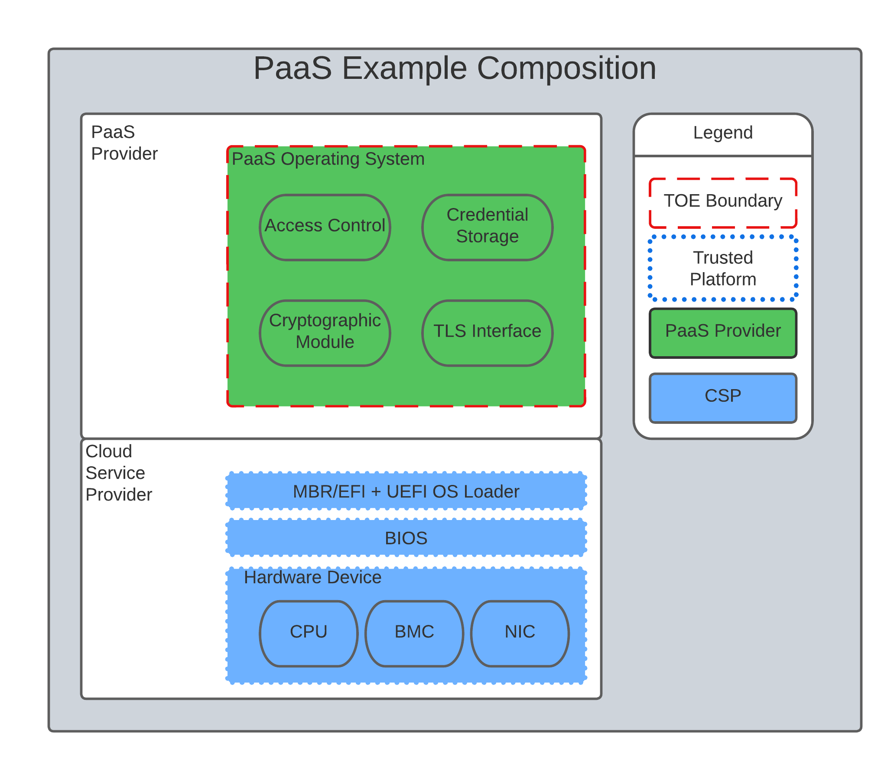
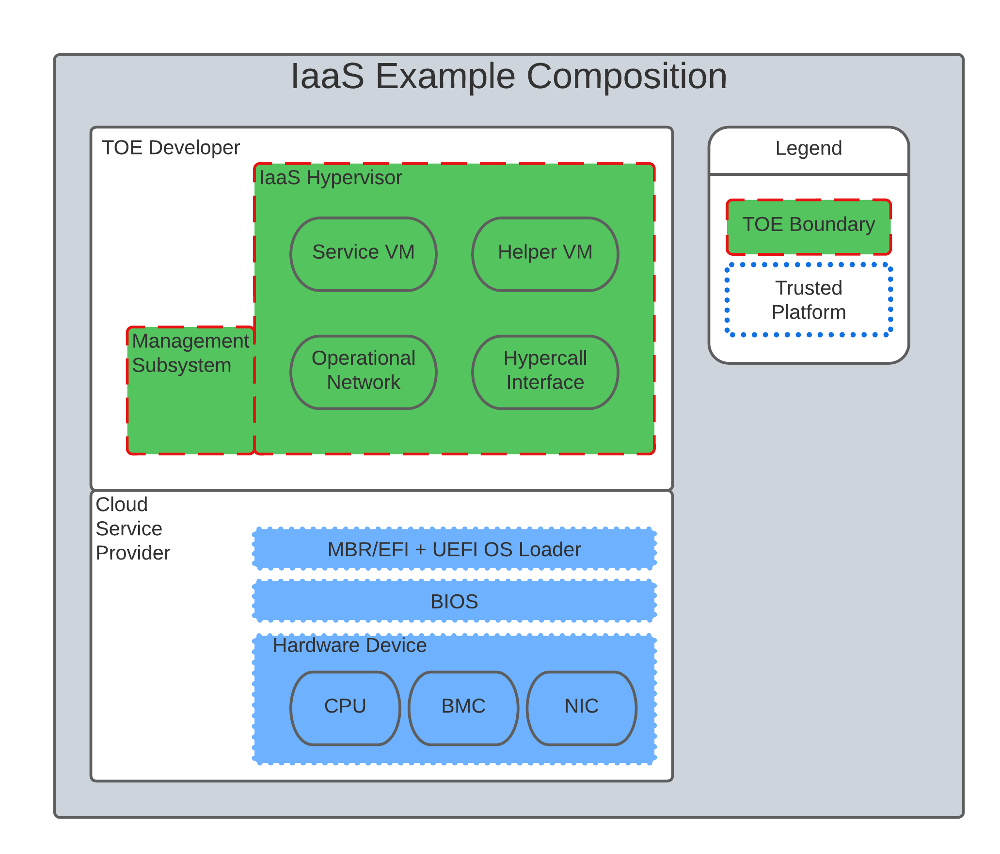
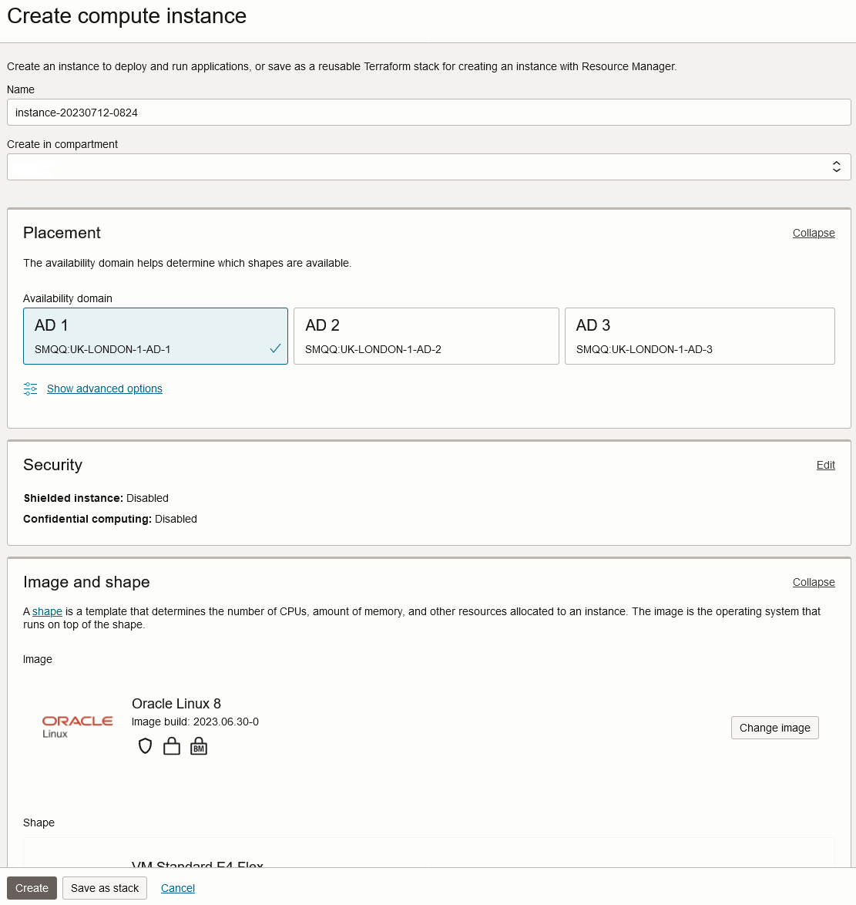

= _CC in the Cloud_ Guidance for Cloud Evaluations
:showtitle:
:icons: font
:revnumber: 0.1
:revdate: 2022-08-17

:iTC-longname: Common Criteria in the Cloud iTC
:iTC-shortname: CCitC-iTC

toc::[]

== Preface

The Common Criteria (CC) in the Cloud Technical Work Group (CCitC) has developed this guidance document that provides a complimentary framework to allow for IT product evaluations in Cloud Operating Environments. It will include instructions and examples of how to extend or develop protection profiles to include cloud environments. The  scope of the CCiTC is to provide for CC evaluations of IT products and not for the evaluation of <<Cloud Services>>.  

Such cloud environments may or may not conform to hybrid, public, or private cloud topologies and the associated Cloud Service Providers (CSP). These topologies can all be accommodated in this approach, with the distinction of administrator access and capability informing their inclusion.  This effort is not meant to replace solution or service oriented frameworks or certification processes such as FedRAMP or other Cloud Authorization schemes.

The main intended audience of this document are Protection Profile authors (e.g. iTCs and national TCs), but it is also useful to evaluators, evaluation authorities, and customers of this type of products. 

== Glossary

The following definitions are used throughout the document. It is important that each term be clearly understood in order that guidance documentation for the evaluation process be put in context. 

=== Bare Metal 

A bare-metal server is a physical computer server that is used by one customer, or tenant, only. Each server offered for rental is a distinct physical piece of hardware that is a functional server on its own.

=== Cloud

A model for enabling ubiquitous, convenient, on-demand network access to a shared pool of configurable computing resources (e.g., networks, servers, storage, applications, and services) that can be rapidly provisioned and released with minimal management effort or service provider interaction.

[CNSSI 4009-2015 from NIST SP 800-145]
[NIST SP 1800-16B under Cloud Computing from NIST SP 800-145]
[NIST SP 1800-16C under Cloud Computing from NIST SP 800-145]
[NIST SP 1800-16D under Cloud Computing from NIST SP 800-145
NISTIR 8401]

=== Cloud Authorization Scheme

A regulatory body or entity that authorizes cloud service offerings for use by their respective governmental agencies or regulated industries.

=== Cloud Service

A Cloud Service is any system that provides on-demand availability of computer system resources, e.g; data storage and computing power, without direct active management by the user.

=== Cloud Service Offering (CSP)
An offering provided to a customer by a Cloud Service Provider

=== Cloud Service Provider (CSP)

A cloud service provider, or CSP, is a company that offers some component of cloud computing; typically infrastructure as a service (IaaS), software as a service (SaaS) or platform as a service (PaaS) to other businesses or individuals.
=== Hosting Environment

The Hosting Environment consists of everything that is outside the TOE boundary and is equivalent to the CC term "Operational Environment."

=== Hybrid Cloud

The cloud infrastructure is a composition of two or more distinct cloud infrastructures (private, community, or public) that remain unique entities, but are bound together by standardized or proprietary technology that enables data and application portability (e.g., cloud bursting for load balancing between clouds).

[NIST SP 1800-16B under Cloud Computing from NIST SP 800-145]

=== Multi-Cloud

A cloud deployment model in which a cloud service customer uses public cloud services provided by two or more cloud service providers

[ISO/IEC 27465]

=== Multi-Tenant

Multi-Tenant uses a shared infrastructure to provide services for multiple cloud customers. Multi-Tenancy means that multiple customers of a cloud vendor are using the same computing resources. Despite the fact that they share resources, cloud customers are logically separated from each other, and their data is isolated.

=== On-Premises (On-Prem)

On-premises refers to IT infrastructure hardware and software applications that are administered on-site at the customer by the customer. The customer has direct control of on-premises IT assets including security, upkeep, and the physical location. Traditionally, Common Criteria has assumed on-premises environments.

There are existing cloud deployment models in which a CSP will deploy infrastructure locally within a customer's physical control as an extension of a Cloud Service. As the CSP maintains administrative control of the infrastructure this shall not be considered an "on-premises" model.

=== Private Cloud

The cloud infrastructure is provisioned for exclusive use by a single organization
comprising multiple customers (e.g., business units). It may be owned, managed, and
operated by the organization, a third party, or some combination of them, and it may exist
on or off premises.

[NIST SP 800-145]

=== Product

Part of the equipment (hardware, software and materials) for which usability is to be specified or evaluated.

[NISTIR 8040 under Product from ISO 9241-11:1998]

=== Service

A set of related IT components provided in support of one or more business processes.

[NISTIR 7693]

=== Trusted Platform

A Trusted Platform is the underlying hosting environment for the TOE that is sufficient to meet the assumptions and environmental security objectives of the PPs and modules the TOE claims.

* The evaluation authority determines sufficiency and may publish a policy.
* Components of a platform may include, e.g., an operating system, virtualization hypervisor, network components or switches, and the hardware needed to run the software.

== Cloud Topology

=== Cloud Use Cases

==== Software as a Service (SaaS)

The capability provided to the customer is to use the provider’s applications running on a cloud infrastructure. The applications are accessible from various client devices through either a thin client interface, such as a web browser (e.g., web-based email), or a program interface. The customer does not manage or control the underlying cloud infrastructure including network, servers, operating systems, storage, or even individual application capabilities, with the possible exception of limited user specific application configuration settings. <<nist_cloud, NIST SP800-145>>

The following PPs are examples which might be extended with CCitC methodology to cover the above use case: cPP_App_SW, cPP_DBMS, PP_MDM

For example, if the cPP for Application Software were to be used as a baseline the cloud extensions may be applied to the existing TOE Boundary and TOE Platform given in the following diagram:

.SaaS Example
image::images/saas.png[SaaS Example]

In this example, the SaaS Application provided by the SaaS provider relies on a TOE platform from an OS Vendor which is hosted by the Cloud Service Provider on the CSP's hardware. In this Cloud evaluation scenario, additional requirements and assurance activities could be prescribed to expand the evaluated configuration in a Cloud Operating Environment. 

==== Platform as a Service (PaaS)

Platform as a Service (PaaS). The capability provided to the customer is to deploy onto the cloud infrastructure customer-created or acquired applications created using programming languages, libraries, services, and tools supported by the provider. The customer does not manage or control the underlying cloud infrastructure including network, servers, operating systems, or storage, but has control over the deployed applications and possibly configuration settings for the application-hosting environment. <<nist_cloud, NIST SP800-145>>

The following PPs are examples which might be extended with CCitC methodology to cover the above use case: PP_OS, cPP_ND

For example, if the Protection Profile for General Purpose Operating System were to be used as a baseline the cloud extensions may be applied to the existing TOE Boundary and Cloud Operating Environment given in the following diagram:

.Paas Example

In this example, the PaaS OS provided by the PaaS provider relies on a Cloud Operating Environment which is hosted by the Cloud Service Provider on the CSPs hardware. In this Cloud evaluation scenario, additional requirements and assurance activities could be prescribed to expand the evaluated configuration to include a Cloud Operating Environment. 

==== Infrastructure as a Service (Iaas)

Infrastructure as a Service (IaaS). The capability provided to the customer is to provision processing, storage, networks, and other fundamental computing resources where the customer is able to deploy and run arbitrary software, which can include operating systems and applications. The customer does not manage or control the underlying cloud infrastructure but has control over operating systems, storage, and deployed applications; and possibly limited control of select networking components (e.g., host firewalls) <<nist_cloud, NIST SP800-145>>

The following PPs are examples which might be extended with CCitC methodology to cover the above use case: PP_BASE_VIRTUALIZATION

For example, if the Protection Profile for Virtualization were to be used as a baseline the cloud extensions may be applied to the existing TOE Boundary and Cloud Operating Environment given in the following diagram:

.IaaS Example

In this example, the IaaS hypervisor provided by the IaaS provider relies on a Cloud Operating Environment which is hosted by the Cloud Service Provider on the CSPs hardware. In this Cloud evaluation scenario, additional requirements and assurance activities could be prescribed to expand the evaluated configuration to include a Cloud Operating Environment. 

== Shared Security Model

In the realm of cloud security, the shared security model is a fundamental concept that defines the division of responsibilities between the Cloud Service Provider (CSP) and their customers within a cloud environment. This model acknowledges that while the CSP is responsible for securing the underlying cloud infrastructure, the customer also bears the responsibility of securing their applications, data, and configurations within that infrastructure based on the service model. The shared security model recognizes that security is a collaborative effort, where both the CSP and the customer play crucial roles. This model is widely embraced in various cloud security frameworks, as it provides a clear model for understanding and allocating security responsibilities in a cloud environment. By delineating these responsibilities, the shared security model helps establish trust, accountability, and transparency between the CSP and the customer, ensuring a holistic approach to cloud security.

This concept is also useful for CCiTC evaluations and mirrors the relationship found with the TOE and TOE Platform. To emphasize the enhanced requirements for Cloud Infrastructure we will refer to the shared responsibility model in terms of the TOE and the Trusted Platform.

In the majority of use cases the TOE administrator (the CSP customer) is responsible for the secure utilization and customization of the cloud services provided by the CSP. This includes managing user access controls, configuring security settings, and implementing appropriate security measures aligned with their specific requirements. These elements may map appropriately to existing SFRs such as FMT_SMF with or without refinement for CCiTC. The TOE administrator ensures that the TOE (cloud tenant) operates securely within the parameters set by the CSP (TOE Platform).

While the CSP maintains the security and availability of the TOE Platform, the TOE administrator (customer) is tasked with safeguarding their applications, data, and configurations within the cloud environment. They actively manage security controls, such as authentication mechanisms, encryption protocols, and network access policies, to protect their assets and mitigate potential risks.

The evaluation and assessment of the shared security model must take into account both the TOE administrator (customer) and the TOE Platform (CSP). The CSP, as the TOE Platform, undergoes evaluation against relevant security standards, certifications, and best practices to demonstrate the effectiveness of the underlying cloud infrastructure's security controls.

Simultaneously, the TOE administrator (customer) is responsible for implementing and managing security controls and configurations within their own cloud environment. They utilize the provided security features, adhere to the CSP's policies and guidelines, and maintain appropriate security configurations to ensure the integrity and confidentiality of their data.

There are certain areas where the shared security model can be somewhat blurred. For example, with many CC evaluations, the TOE or TSFI is expected to exclusively generate TOE audit events. In the context of a virtualized network device deployed on a public cloud, certain Common Criteria (CC) requirements, such as FAU_GEN.1 (Audit Generation), would need to be modified to account for the consumption of logs provided by the Cloud Service Provider (CSP).

FAU_GEN.1 requires the TOE (virtualized network device) to generate audit records for security-relevant events. However, in a cloud environment, the CSP typically manages the underlying infrastructure and maintains centralized logging systems. As a result, the TOE may rely on the CSP's log management capabilities and consume the logs provided by the CSP rather than generating its own audit records.

To accommodate this scenario, the collaborative protection profile for the virtualized network device on the public cloud should specify the requirements for log consumption from the CSP's logging infrastructure. This would include defining the format, content, and frequency of logs to be provided by the CSP. Additionally, the protection profile should address the integrity and confidentiality of these logs during transmission and storage.

The modified CC requirements would then focus on the TOE's capability to securely receive, process, and analyze the logs provided by the CSP. The TOE should be able to extract relevant security events from the logs and correlate them with its own internal security policies. Furthermore, it should have the ability to raise alerts or initiate appropriate actions based on the analysis of the consumed logs.

By adapting CC requirements like FAU_GEN.1 to encompass log consumption from the CSP, the protection profile enables the virtualized network device to leverage the logging capabilities provided by the CSP while maintaining compliance with CC standards. This ensures that security-relevant events are properly logged, analyzed, and acted upon in the cloud environment, contributing to a comprehensive security posture for the virtualized network device.

Additionally, it may be important to add a third element to the shared security model for CCiTC evaluations. This would be the inclusion of the TOE Vendor in addition to the TOE Administrator and CSP. The TOE Vendor may be responsible for providing TOE security updates, maintaining a trusted update channel and infrastructure, or even applying these updates on behalf of the TOE Administrator. This is a common feature with traditional SaaS use cases. In such cases where a TOE vendor is expected to share responsibilities in the security model, PP Authors must make the appropriate refinements, additions, or iterations of related elements in their PPs. This is a scenario that may be more common in TOE types that are meant to incorporate physical hardware into Cloud Infrastructure such as an HSM. However, CCiTC evaluations are not limited to a particular deployment model. It is also expected that there will be evaluations of TOEs that are integral to a CSPs cloud stack from hardware to application layers.

Ultimately, by designating the customer as the TOE administrator, the shared security model reinforces their active involvement in the secure administration of the cloud services. The CSP, as the TOE Platform, provides the underlying infrastructure, while the TOE administrator assumes the responsibility of effectively configuring, managing, and monitoring the TOE to meet their specific security objectives and compliance requirements.

To ensure that customers acting as TOE administrators, who are familiar with Common Criteria but may have limited knowledge of cloud infrastructure and security, can effectively manage the TOE within the shared security model, it is important for the authors of protection profiles to adapt the Administrator Guidance Document (AGD) requirements accordingly. This includes providing clear instructions, accessible language, and practical guidance tailored to TOE administrators. By modifying the AGD requirements in this manner, the authors of protection profiles can ensure that TOE administrators can confidently manage the TOE within the shared security model, bridging the gap between Common Criteria expertise and the challenges of managing security in a cloud environment.

Additionally, The TSS, which defines the security functionality and assurance requirements of the TOE, can be modified by the authors of protection profiles to provide clear explanations tailored to evaluators limited knowledge of cloud infrastructure and security. The modified TSS should include detailed information such that it is clear how the TSFI or SFR enforcing features interact in a cloud context with the TOE Platform. 

By adapting the TSS and AGD requirements in this manner, the authors of protection profiles can ensure that TOE administrators with limited knowledge of cloud infrastructure and security can confidently manage the TOE within the shared security model. These modifications provide clear and accessible guidance, empowering TOE administrators to make informed decisions, configure the TOE securely, and fulfill their security responsibilities effectively.

== TOE Identification

When deploying a Target of Evaluation (TOE) to public cloud infrastructure, proper identification and distinction of the TOE instances are crucial. This ensures accurate tracking, management, and application of security controls specific to each TOE instance within the cloud environment. In this section, we will explain how TOE identification can be established when deploying TOE instances on popular public cloud platforms such as AWS, Azure, and Oracle Cloud Infrastructure.

AWS (Amazon Web Services):

In AWS, TOE instances can be provisioned as either bare metal instances or virtual machines (VMs) based on the specific requirements. AWS offers different services such as Amazon EC2 (Elastic Compute Cloud) for VM instances and Amazon EC2 Bare Metal instances for bare metal deployment. During the provisioning process, unique identifiers such as instance IDs, resource tags, and naming conventions can be utilized to supplement TOE identification. By assigning descriptive tags and naming conventions, TOE administrators can easily distinguish and manage each TOE instance.

.AWS Example
image::images/aws1.png[AWS Example]

.AWS Example
image::images/aws2.png[AWS Example]

.AWS Example
image::images/aws3.png[AWS Example]

Azure:

In Azure, TOE instances can be created using Virtual Machines or Azure Dedicated Hosts for bare metal deployment. When deploying VM instances, Azure assigns a unique resource ID, which can be used for TOE identification. Additionally, Azure Resource Manager (ARM) tags and labels can be assigned to each TOE instance for effective identification and categorization. These tags can include metadata such as TOE name, version, environment, or any other relevant information that aids in TOE management and identification.

.Azure Example
image::images/azure1.png[AWS Example]

.Azure Example
image::images/azure2.png[AWS Example]

.Azure Example
image::images/azure3.png[AWS Example]

.Azure Example
image::images/azure4.png[AWS Example]

.Azure Example
image::images/azure5.png[AWS Example]

Oracle Cloud Infrastructure:

Oracle Cloud Infrastructure (OCI) enables the deployment of TOE instances using Oracle VMs or bare metal compute shapes. OCI assigns a unique OCID (Oracle Cloud Identifier) to each compute instance, serving as a reliable identifier for TOE instances. Administrators can further enhance TOE identification by leveraging OCI's tagging system, which allows the assignment of user-defined tags. These tags can be utilized to categorize and identify TOE instances based on their specific attributes and requirements.

.OCI Example

.OCI Example
image::images/oci2.png[AWS Example]

.OCI Example
image::images/oci3.png[AWS Example]

By utilizing unique identifiers, resource tags, naming conventions, and metadata labels provided by the respective cloud platforms, TOE identification can be effectively established in public cloud infrastructure deployments. These identification mechanisms aid in maintaining clear visibility, control, and management of TOE instances, enabling administrators to enforce security controls and monitor the specific security posture of each deployed TOE instance within the public cloud environment.

== Cloud Equivalence Considerations

In general, products must be tested individually on each desired cloud service offering.

The Cloud Service Offering (to include cloud region or datacenter) must be detailed in the TOE evaluated configuration details. CSOs can not inherently be assumed to be equivalent. For instance, CSPs may have separate environments between government or commercial customers. However, if existing cloud authorizations exist for multiple regions or datacenters this may inform equivalency claims. Especially if the Trusted Platform meets the assumptions and objectives of the PP and is consistent across multiple cloud regions. CC Scheme policy may define acceptance criteria.

=== CPU Equivalency 

Applicable guidance shall be followed when labeling Operational Environments. Such as:

For a Type 1 (or native) hypervisor, where the hypervisor runs directly on the hardware, the OE
listing shall include the guest OS, hypervisor, and processor using the following format: “Guest
OS on hypervisor on Processor.” An example is “Microsoft Windows 11 on VMWare ESXi 7.0
on Intel Xeon W (Rocket Lake).”

For a Type 2 (or hosted) hypervisor, where the hypervisor runs on a host operating system (OS),
the OE listing shall include the guest OS, hypervisor, host OS, and processor using the following
format: “Guest OS on hypervisor on Host OS on Processor.” An example is “Microsoft
Windows 11 on Parallels Desktop 17 on macOS Monterey on Intel Core i7 (Kaby Lake).”

Algorithm tests may also be performed using containers. The OE listing shall include the
container, runtime, host OS, and processor using the following format: “container on runtime on
host OS on processor.” An example is “Ubuntu 20.04 Docker Image on Docker Engine 20 on
Ubuntu 20.04 on Intel Xeon W (Rocket Lake).”

TOE's that are being evaluated in a cloud context are expected to be able to conclusively demonstrate knowledge of the underlying TOE Platform for these specifics. If SFR enforcing functionality is agnostic to the TOE platform, such equivalency claims may be made. 

E.g. CPU model / OS / Hypervisor / Guest OS / Container shall be defined where appropriate. 

At this time, if a TOE is reliant on the OE for cryptographic operations, there is no need to leverage the related collateral that explicitly states operation for a given Cloud Provider. This equivalence rationale should also be considered when a TOE vendor is reliant upon a CSP for algorithm certification and many TOE platforms are claimed.

== Contributors Roles in Product Evaluations

=== Roles Clarification

==== Administrator

Entity that has a level of trust with respect to all policies implemented by the TOE security functionality [CC:2022 Part 1]

==== Customer

A customer of the Cloud Service Provier. Also may be the administrator for the TOE 

==== Developer

Organization responsible for the development of the TOE [CC:2022 Part 1]

==== Cloud Service Provider (CSP)

A cloud service provider, or CSP, is an entity that offers some component of cloud computing; typically infrastructure as a service (IaaS), software as a service (SaaS) or platform as a service (PaaS) to other businesses or individuals.

==== Evaluation Authority (EA)

Body operating an evaluation scheme [CC:2022 Part 1]

==== Evaluator

individual assigned to perform evaluations in accordance with a given evaluation standard and associated evaluation methodology [CC:2022 Part 1]

===== Evaluator Guidance

Placeholder for Issue #74

[From CC:2022 Part 1 for Evaluator]

=== Contributors Involvement

This section would be useful for explaining the relationships possible between the TOE Vendor, CSP, and Trusted Platform. 

== Steps to optimize a PP for TOEs in a cloud environment.

A PP comprises of a number of sections and each should be reviewed and updated in order to give directions to ST authors for TOEs in a cloud environment:

=== Process Overview

* Review this guidance document and associated instructions
* Map Assumptions, Security Objections for the Operational Environment, and Organizational Security Policies to applicable authorization scheme(s) as a reference implementation (FedRamp, C5, etc)
** Summarize this mapping in generic language for wider Cloud Authorization adoption i.e. consideration in other authorization schemes
*** Determine the extent to which SFRs and SARs in the PP can rely on the OE to be satisfied so that the extent to which the TSF may need to rely on cloud services can be determined. 
** Identify SFR challenges in a cloud operational environment
*** For example certain requirements collecting test evidence may be complicated by the cloud operational environment and may not be directly accessible due to cloud isolation.
**** Many TOEs that will operate in a cloud environment will utilize object storage as provided by the CSP. These objects will often be encrypted either by the TOE itself or by the CSP. For instances in which the CSP is providing encryption of the storage object, it is expected that the TOE vendor or evaluator will not be able to perform assurance activity tests with regards to Key Destruction. PP authors will be expected to make modifications to related SFRs to allow for CSP Key Destruction or Zeroization as additional selections.
**** Such modifications may be made by iterating the underlying SFR in a base PP into a "Cloud" PP module which provides the cloud-specific selections and assurance activities.
** Identify SAR challenges with either new/updated SAR's and/or determine if applicable
*** For example AVA may have different considerations for a cloud operating environment depending on the TOE or PP. See <<Vulnerability Assessment Methodology>> for more information.
* Edit cPP/PP and add new optional or selection based SFRs/SARs for cloud evaluations
* Update cPPs supporting documents with new cloud requirements and applicable assurance activities.

=== Conformance Claims

It is not expected that changes would be required to the Conformance Claims chapter. 

PP editors may consider including a reference to this guidance document within the updated PP.

=== Security Problem Definition

This chapter describes security problems in terms of threats, assumptions and organizational security policies.

Appendix A details the Threats, Assumptions, Security Objectives for the TOE, and Security Objectives for the operational environment for a number of PP’s of interest.

Generally within the PP’s proposed, the Network Device and Application Software PPs are used the most.

In Appendix B specific aspects of the Assumptions and Security Objectives for the Operational Environment were considered to determine whether assumptions made for each PP of interest are consistent and could be satisfied by a cloud environment. The analysis found that the assumptions and Security Objectives of the Operating Environment for PP’s of interest are consistent: There are generally only three categories: Platform Integrity, Proper (Non-Malicious User) and Proper (Trusted) Admin. The virtualization PP considers also Physical Security but this not considered by the other PPs.

It is not necessarily expected that a cloud environment will introduce new threats, assumptions or organizational security policies, although the PP writers may wish to consider whether existing threats, assumptions and organization security policies should be refined to provide more explanation in the case of cloud.  For example, threat models may consider the impact of potential ubiquitous access and multi-tenancy to either add to existing threats, assumptions and organizational security policies or refine them.

=== Security Objectives

Security Objectives for the TOE map to security functionalities/services of the TOE itself so it is not expected that changes would be required.

As described in Appendix B of this document, the Security Objectives of the Operating Environment provide the general requirements that should be satisfied by the cloud environment. It is proposed that PP's should include an appendix as guidance for an evaluator to assess whether the cloud environment for the TOE satisfies the Security Objectives of the Operating Environment of the PP. In the context of the PP’s highlighted, where the assurance level is low (no development security requirements, vulnerability requirements at AVA_VAN.1: public search), the assumptions and Security Objectives of the Operating Environment should be sufficiently satisfied by any suitable cloud security certification process recognized by a national government supporting Common Criteria, that addresses the environment being used(e.g. lowest level Fedramp, BSI C5 baseline, ISO27017).

The Security Objectives rationale is not expected to change, unless additional threats, assumptions or security objectives have been added.

=== Security Requirements.

It is expected that some additional application notes would be appended to a PP regarding Security Requirements.

Security Functional Requirements should be each considered carefully as to whether there may be dependency on the cloud platform.

For example, Cryptographic Support (FCS) may include cryptographic operations using services of the platform, or random number generation derived from platform entropy sources. Others example would be any SFRs around boot integrity and maybe key destruction.

Depending on the type of technology and the associated test scenarios some modification to SFRs will be necessary. 

A product that operates identically outside of a cloud operating environment may not require changes.

A product that is only designed to operate in a cloud-native context may need refinements to requirements to the PP.

.MDMExample
----
Place example here
----

=== Security Assurance Requirements.

Classes ASE and ADV are not expected to require change.

Class AGD will be evaluated similarly but the developer must provide guidance both the AGD_PRE and AGD_OPE that work for the cloud platform.

There also may be two scenarios for guidance:

[lowerroman]
. A developer providing guidance for their TOE to be installed and operated in a cloud environment. This may look very similar to the guidance for a typical ‘on-prem’ installation.
. A developer providing guidance for their TOE to be installed and operated on their own cloud environment. In this case the develop may provide installation and operational instructions specific to their cloud platform.

Class ALC changes expected to be minimal and should be resolved with minor adjustments. However, it is likely that care will be required around Flaw remediation and similar ALC aspects (including ALC_TSU_EXT.1.1 Timely Security Updates) as how they would work in a cloud platform.

Class ATE will require some additional application notes required around ‘provide the OS for testing’ for a cloud environment.

Class AVA would not be expected to require significant additional application notes.

=== Other considerations

A text search of the term ‘platform’ is likely to highlight areas of a PP that will require modification in order to support evaluations in a Cloud environment (if not already resolved with the activities in sections 3.1-3.6

== Cloud Sub-Processes

=== Introduction

This section in the JIL guidance is meant to help vendors "anticipate their development capability to comply to the requirements of CC". For the CCiTC purposes, this should provide guidance to PP authors and Evaluators how to augment CC deliverables for cloud evaluations.

=== Development Environment Sub-Process

It may be necessary for the iTC to provide additional assurance strategies for PP authors to incorporate more development environment review. The goal of which is to support Dev Ops practices and facilitate cloud evaluations that allow the customer some assurance apart from fixed version evaluations.

For example if a TOE vendor is leveraging a cloud providers container images to deploy a software product, the Development Environment sub-process should require additional collateral to demonstrate that the cloud provider is providing assurance to the TOE vendor for the image that it is appropriately signed and/or updated.

FEDRamp PaaS OS images can be assumed to receive continuos vulnerability patching to maintain authorization and that collateral can be extended to CCiTC.

.TrustedProviderMaterial
---
Place output from TP group here
---

=== Security Target (TSS) Sub-Process

This section shall discuss the expected changes to a Security Target for cloud evaluations. This also may be better suited to address SFR changes needed in a PP. For example, changes need to address SFRs that deal with credential management:

For example, for all Assurance Activities that extend TOE Summary Specification (TSS) requirements in a ST will need to be modified such that Cloud Operating Environments are captured.

Due to the fungible nature of compute resourcing in a Cloud Environment, traditional methods of credential storage to a local operating environment are not viable. Cloud IAM, Token, and Key management are often adapted to Cloud Products and these changes must be reflected in the associated TSS requirements. 

.TrustedProviderSFR
---
Put TP SFR details here
---

=== Guidance Documentation Sub-Process

This section shall discuss the increased requirements of product configuration in cloud environments.

It is important to distinguish here that not all expected elements of a traditional AGD document can be translated for Cloud Environments. It may be necessary to exclude or supplement these guidance requirements depending on the topology of the product and the cloud service provider. In some circumstances, the Cloud Provider is the only entity that may fulfill these guidance requirements to ensure that the TOE is deployed in the tested configuration. If a trusted platform is used, this exclusion may be minimized. 

For example, auditing an on-prem resources versus an equivalent resource deployed to in a cloud environment presents a number of additional considerations. When developing guidance requirements, PP Authors must consider the following common pitfalls for auditing services in Cloud Environments and tailor appropriately as needed for the product technology type and Cloud topology:

* No container or host process activity monitoring
* No network communications monitoring among microservices
* No resource consumption monitoring to ensure availability of critical resources
* Lack of monitoring on orchestration configuration propagation and stale configs

CC Guide Modifications:

* Installation Guidance
** Typically CC Guidance contains instructions on how to configure the TOE exactly as tested. Due to the ethereal nature of cloud platforms, this is often untenable for a variety of reasons. As such, CC guidance must be extended to ensure that the fundamental controls to deploy the TOE in a cloud environment securely are captured.The following items will focus on particular areas of concern.
* Crytpo Config
** D@RE
*** KMS/HMS Config
** DiT
* Setting Time / Time Zone for Clound Tenancy
* Audit config
* Cloud Dependencies
** Platform Configuration
*** This should explain how your cloud platform management plane is set up to allow for the TOE (esxi config/kubernetes config/etc)
**** Container Orchestration settings
*** Containerization Settings
**** Privilege Container Settings
**** Network bridge settings
*** Platform Isolation
** Env. Variables
** Network Resource Configuration
*** Network Isolation 
** Data Storage Resource Configuration
*** DB or Storage Isolation 
** Token generation
* Uninstallation/Removal Guidance
** Destruction of Secrets
** Data santization

This section may need a table to map the list items into a table for SaaS / PaaS / IaaS.

=== Development / Tests Sub-Process

This section shall discuss augmentations needed for assurance activities that are targeting cloud evaluations.

Depending on the type of technology and the associated test scenarios some modification of test methodology will be necessary. 

A product that operates identically outside of a cloud operating environment may not require changes.

A product that is only designed to operate in a cloud-native context may need refinements to test cases to be accommodated by the appropriate Technical Community. 

==== Guidance For Establishing Test Environments on Cloud Infrastructure

As Common Criteria testing requires unique test environments for each TOE that are isolated to prevent contamination of test results, testing on Public Cloud infrastructure raises some initial concerns. 

In general, the necessity to abstract from underlying hardware layers is dictated by the TOE type in Protection Profiles. For instance, the cPP for Application Software relies only on the underlying OS and makes no distinction on whether that OS is virtualized or not. In this scenario bare metal isolation in the cloud testing would be unnecessary and  a multi-tenancy environment is acceptable. 

An evaluator should be prepared to create and offer cloud testing infrastructure to TOE developers. This environment must establish controls provided by the CSP to establish effective isolation equivalent to on-prem testing to ensure the integrity of results. This may involve isolated VLANs, ACLs, Compute Resources, etc on multi-tenant infrastructure. This information will need to be captured and presented to Evaluation Authorities as evaluation deliverables. 

.ExamplesFromMDM
----
PlaceHolder for Example AA modification
----

== Vulnerability Assessment Methodology

In general, the AVA methodology shall be sufficient for most TOE types. However, certain edge cases may present themselves. 

As we have introduced a trusted platform concept, underlying vulnerabilities in the cloud operating environment can be treated as they are in traditional OE analysis.

However, when applicable vulnerabilities are discovered or suspected for TOEs operating in a cloud environment the means in which evaluators are expected to shift negative test coverage must utilize cloud attack vectors. I.e. service portal, management plane, etc.

=== List of potential vulnerabilities

Since a cloud stack will inherently contain many vulnerabilities, it would be useful for the iTC to provide guidance on risk management practices to minimize these factors.

=== Defining penetration tests

The JIL Guidance uses this section on how to compose the penetration testing coverage needed. This may need to be expanded given the content above or removed entirely from the CCiTC guidance.

=== List of attacks and strategies

The JIL Guidance uses this section to allow for attacker potential mitigation. The iTC will need to provide some language here to adapt for cloud evaluations.

== References

* [nist_cloud] NIST SP 800-145 "The NIST Definition of Cloud
* [CC_2022] Common Criteria for Information Technology Security Evaluation, November 2022

== Appendix A: Threats, Assumptions and Security Objectives for each PP.

=== Protection Profile for General Purpose Computing Platform, Version 1.0

==== Use Cases 

[USE CASE 1]: Server-Class Platform, Basic

This use case encompasses server-class hardware in a data center. There are no additional physical protections required because the platform is assumed to be protected by the operational environment as indicated by A.PHYSICAL_PROTECTION. The platform is administered through a management controller that accesses the MC through a console or remotely.

This use case adds audit requirements and Administrator authentication requirements to the base mandatory requirements.

For changes to included SFRs, selections, and assignments required for this use case, see G.1 Server-Class Platform, Basic.

==== Threats

T.PHYSICAL +
T.SIDE_CHANNEL_LEAKAGE +
T.PERSISTENCE +
T.UPDATE_COMPROMISE +
T.SECURITY_FUNCTIONALITY_FAILURE +
T.TENANT_BASED_ATTACK +
T.NETWORK_BASED_ATTACK +
T.UNAUTHORIZED_RECONFIGURATION +
T.UNAUTHORIZED_PLATFORM_ADMINISTRATOR

==== Assumptions

A.PHYSICAL_PROTECTION +
A.ROT_INTEGRITY +
A.TRUSTED_ADMIN +
A.MFR_ROT +
A.TRUSTED_DEVELOPMENT_AND_BUILD_PROCESSES +
A.SUPPLY_CHAIN_SECURITY +
A.CORRECT_INITIAL_CONFIGURATION +
A.TRUSTED_USERS +
A.REGULAR_UPDATES

==== Security Objectives for the TOE

O.PHYSICAL_INTEGRITY +
O.ATTACK_DECECTION_AND_RESPONSE +
O.MITIGATE_FUNDAMENTAL_FLAWS +
O.PROTECTED_FIRMWARE +
O.UPDATE_INTEGRITY +
O.STRONG_CRYPTOGRAPHY +
O.SECURITY_FUNCTIONALITY_INTEGRITY +
O.TENANT_SECURITY +
O.TRUSTED_CHANNELS +
O.CONFIGURATION_INTEGRITY +
O.AUTHORIZED_ADMINISTRATOR

==== 

==== 

==== Security Objectives for the Operational Environment

OE.PHYSICAL_PROTECTION +
OE.SUPPLY_CHAIN +
OE.TRUSTED_ADMIN

=== Base PP for Virtualization Version 1.1

==== Use Cases 

None for Cloud

==== Threats

T.DATA_LEAKAGE +
T.UNAUTHORISED_UPDATE +
T.UNAUTHORIZED_MODIFICATION +
T.USER_ERROR +
T.3P_SOFTWARE +
T.VMM_COMPROMISE +
T.PLATFORM_COMPROMISE +
T.UNAUTHORIZED_ACCESS +
T.WEAK_CRYPTO +
T.UNPATCHED_SOFTWARE +
T.MISCONFIGURATION +
T.DENIAL_OF_SERVICE

==== Assumptions

A.PLATFORM_INTEGRITY +
A.PHYSICAL +
A.TRUSTED_ADMIN +
A.NON_MALICIOUS_USER
 

==== Security Objectives for the TOE

O.VM_ISOLATION +
O.VMM_INTEGRITY +
O.PLATFORM_INTEGRITY +
O.DOMAIN_INTEGRITY +
O.MANAGEMENT_ACCESS +
O.PATCHED_SOFTWARE +
O.VM_ENTROPY +
O.AUDIT +
O.CORRECTLY_APPLIED_CONFIGURATION +
O.RESOURCE_ALLOCATION

==== Security Objectives for the Operational Environment

OE.CONFIG +
OE.PHYSICAL +
OE.TRUSTED_ADMIN +
OE.NON_MALICIOUS_USER

=== Protection Profile for General Purpose Operating Systems Version 4.3

==== [USE CASE 3] Cloud Systems

The OS provides a platform for providing cloud services running on physical or virtual hardware. An OS is typically part of offerings identified as Infrastructure as a Service (IaaS), Software as a Service (SaaS), and Platform as a Service (PaaS).

This use case typically involves the use of virtualization technology which should be evaluated against the Protection Profile for Server Virtualization.

==== Threats

T.NETWORK_ATTACK +
T.NETWORK_EAVESDROP +
T.LOCAL_ATTACK +
T.LIMITED_PHYSICAL_ACCESS

==== Assumptions

A.PLATFORM +
A.PROPER_USER +
A.PROPER_ADMIN

==== Security Objectives for the Operational Environment

OE.PLATFORM +
OE.PROPER_USER +
OE.PROPER_ADMIN

=== Protection Profile for Application Software Version 1.4

==== Use Cases 

None for Cloud

==== Threats

T.NETWORK_ATTACK +
T.NETWORK_EAVESDROP +
T.LOCAL_ATTACK +
T. PHYSICAL_ACCESS

==== Assumptions

A.PLATFORM (+ time clock) +
A.PROPER_USER +
A.PROPER_ADMIN

==== Security Objectives for the TOE +
O.INTEGRITY +
O.QUALITY +
O.MANAGEMENT +
O.PROTECTED_STORAGE +
O.PROTECTED_COMMS

==== Security Objectives for the Operational Environment

OE.PLATFORM +
OE.PROPER_USER +
OE.PROPER_ADMIN

== Appendix B. Analysis of the Assumptions and Security Objectives of the Operating Environment for an example stack of PP’s

As a way of gaining understanding of how existing PP’s may work within the cloud environment, a ‘composition stack’ of PP’s is considered.

As an example,

An Application,
____
*(PP for Application Software)*
____
or Network Device  
____
*(Network Device cPP)*
____
running on an Operating System, 
____
*(PP for General Purpose Operating System)*
____

running in a VM, 
____
*(Base PP for Virtualization)*
____

on a Server.      
____
*(PP for General Purpose Computing Platform)*
____

 

It can be observed that for each PP higher in the stack, it may rely on security services that may or may not be provided by PP’s lower in the stack. It can also generally be observed that the ‘Platform’ for any PP tends to the be PP immediately below in the stack.

image::images/ppstack.png[]

The assumptions and Security Objectives of the Operating Environment for the three PP’s map in this example map well to each other. There are generally only three categories: Platform Integrity, Proper (Non-Malicious User) and Proper (Trusted) Admin. The virtualization PP considers also Physical Security but this not considered by the other PPs.

In the context of these PP’s, where the assurance level is low (no development security requirements, vulnerability requirements at AVA_VAN.1: public search), the assumptions and Security Objectives of the Operating Environment should be sufficiently satisfied by any suitable cloud security certification process recognized by a national government supporting Common Criteria that addresses the environment being used. (e.g. lowest level Fedramp, BSI C5 baseline, ISO27017).

If the General Purpose Computing Platform PP is adopted by vendors for cloud infrastructure, then this could be added to the model since it is a number of additional assumptions around root-of-trust and supply chain security that could provide additional assurance.

image::images/GPCP.png[]
