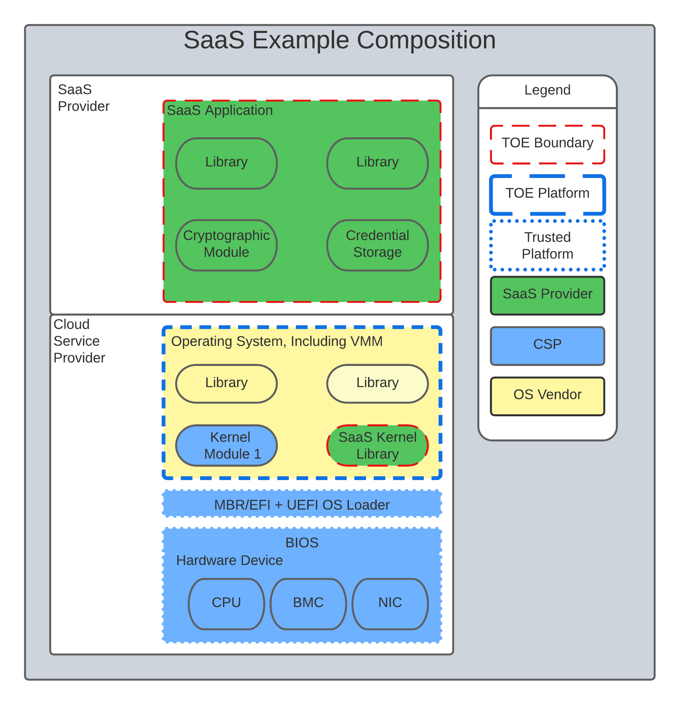

= _CC in the Cloud_ Guidance for Cloud Evaluations
:showtitle:
:icons: font
:revnumber: 0.1
:revdate: 2022-08-17

:iTC-longname: Common Criteria in the Cloud iTC
:iTC-shortname: CCitC-iTC

== Preface

The Common Criteria (CC) in the Cloud Technical Work Group (CCitC) has developed this guidance document that provides a complimentary framework to allow for TOE evaluations in Cloud Operating Environments. 

It will include instructions and examples of how to extend or develop protection profiles to include cloud environments.

Such cloud environments may or may not conform to hybrid, public, or private cloud topologies and the associated Cloud Service Providers (CSP). These topologies can all be accommodated in this approach, with the distinction of administrator access and capability informing their inclusion.  This effort is not meant to replace solution or service oriented frameworks or certification processes such as FedRAMP or other Cloud Authorization schemes.

The main intended audience of this document are Protection Profile authors (e.g. iTCs and national TCs), but it is also useful to evaluators, evaluation authorities, and end users of this type of products. 

== Cloud Service and Product Presentation and Definitions

=== Glossary

The following definitions are used throughout the document. It is important that each term be clearly understood in order that guidance documentation for the evaluation process be put in context. 

==== Product

Part of the equipment (hardware, software and materials) for which usability is to be specified or evaluated.

[NISTIR 8040 under Product from ISO 9241-11:1998]

==== Service

A set of related IT components provided in support of one or more business processes.

[NISTIR 7693]

==== Cloud

A model for enabling ubiquitous, convenient, on-demand network access to a shared pool of configurable computing resources (e.g., networks, servers, storage, applications, and services) that can be rapidly provisioned and released with minimal management effort or service provider interaction.

[CNSSI 4009-2015 from NIST SP 800-145]
[NIST SP 1800-16B under Cloud Computing from NIST SP 800-145]
[NIST SP 1800-16C under Cloud Computing from NIST SP 800-145]
[NIST SP 1800-16D under Cloud Computing from NIST SP 800-145
NISTIR 8401]

==== Hosting Environment

==== Hybrid Cloud

The cloud infrastructure is a composition of two or more distinct cloud infrastructures (private, community, or public) that remain unique entities, but are bound together by standardized or proprietary technology that enables data and application portability (e.g., cloud bursting for load balancing between clouds).

[NIST SP 1800-16B under Cloud Computing from NIST SP 800-145]

==== Private Cloud

The cloud infrastructure is provisioned for exclusive use by a single organization
comprising multiple consumers (e.g., business units). It may be owned, managed, and
operated by the organization, a third party, or some combination of them, and it may exist
on or off premises.

[NIST SP 800-145]

==== Multi-Cloud

A cloud deployment model in which a cloud service customer uses public cloud services provided by two or more cloud service providers

[ISO/IEC 27465]

==== Software as a Service (SaaS)

The capability provided to the consumer is to use the provider’s applications running on a cloud infrastructure. The applications are accessible from various client devices through either a thin client interface, such as a web browser (e.g., web-based email), or a program interface. The consumer does not manage or control the underlying cloud infrastructure including network, servers, operating systems, storage, or even individual application capabilities, with the possible exception of limited user specific application configuration settings. <<nist_cloud, NIST SP800-145>>

The following PPs are examples which might be extended with CCitC methodology to cover the above use case: cPP_App_SW, cPP_DBMS, PP_MDM

For example, if the cPP for Application Software were to be used as a baseline the cloud extensions may be applied to the existing TOE Boundary and TOE Platform given in the following diagram:

.SaaS Example

In this example, the SaaS Application provided by the SaaS provider relies on a TOE platform from an OS Vendor which is hosted by the Cloud Service Provider on the CSP's hardware. In this Cloud evaluation scenario, additional requirements and assurance activities could be prescribed to expand the evaluated configuration in a Cloud Operating Environment. 

==== Platform as a Service (PaaS)

Platform as a Service (PaaS). The capability provided to the consumer is to deploy onto the cloud infrastructure consumer-created or acquired applications created using programming languages, libraries, services, and tools supported by the provider. The consumer does not manage or control the underlying cloud infrastructure including network, servers, operating systems, or storage, but has control over the deployed applications and possibly configuration settings for the application-hosting environment. <<nist_cloud, NIST SP800-145>>

The following PPs are examples which might be extended with CCitC methodology to cover the above use case: PP_OS, cPP_ND

For example, if the Protection Profile for General Purpose Operating System were to be used as a baseline the cloud extensions may be applied to the existing TOE Boundary and Cloud Operating Environment given in the following diagram:

.Paas Example
image::images/paas.png[PaaS Example]

In this example, the PaaS OS provided by the PaaS provider relies on a Cloud Operating Environment which is hosted by the Cloud Service Provider on the CSPs hardware. In this Cloud evaluation scenario, additional requirements and assurance activities could be prescribed to expand the evaluated configuration to include a Cloud Operating Environment. 

==== Infrastructure as a Service (Iaas)

Infrastructure as a Service (IaaS). The capability provided to the consumer is to provision processing, storage, networks, and other fundamental computing resources where the consumer is able to deploy and run arbitrary software, which can include operating systems and applications. The consumer does not manage or control the underlying cloud infrastructure but has control over operating systems, storage, and deployed applications; and possibly limited control of select networking components (e.g., host firewalls) <<nist_cloud, NIST SP800-145>>

The following PPs are examples which might be extended with CCitC methodology to cover the above use case: PP_BASE_VIRTUALIZATION

For example, if the Protection Profile for Virtualization were to be used as a baseline the cloud extensions may be applied to the existing TOE Boundary and Cloud Operating Environment given in the following diagram:

.IaaS Example
image::images/iaas.png[IaaS Example]

In this example, the IaaS hypervisor provided by the IaaS provider relies on a Cloud Operating Environment which is hosted by the Cloud Service Provider on the CSPs hardware. In this Cloud evaluation scenario, additional requirements and assurance activities could be prescribed to expand the evaluated configuration to include a Cloud Operating Environment. 
x
==== On-Premises (On-Prem)

On-premises refers to IT infrastructure hardware and software applications that are administered on-site at the customer by the customer. The customer has direct control of on-premises IT assets including security, upkeep, and the physical location. Traditionally, Common Criteria has assumed on-premises environments.

There are existing cloud deployment models in which a CSP will deploy infrastructure locally within a customer's physical control as an extension of a Cloud Service. As the CSP maintains administrative control of the infrastructure this shall not be considered an "on-premises" model.

==== Cloud Service Provider (CSP)

A cloud service provider, or CSP, is a company that offers some component of cloud computing; typically infrastructure as a service (IaaS), software as a service (SaaS) or platform as a service (PaaS) to other businesses or individuals.

==== Trusted Cloud Service Provider (TCSP)

Will define as a group.

==== Trusted Platform

A Trusted Platform is the underlying hosting environment for the TOE that is sufficient to meet the assumptions and environmental security objectives of the PPs and modules the TOE claims.

* The certificate authorizing scheme determines sufficiency and may publish a policy.
* Components of a platform may include, e.g., an operating system, virtualization hypervisor, network components or switches, and the hardware needed to run the software.

==== Cloud Authorization Scheme
Please log definition as github issue.

==== Cloud Extensions

Modifications or other adaptions to Common Criteria work products such as Protection Profiles to accommodate CC evaluations in the cloud. As an example, a Cloud Module for a base PP.

== Contributors Roles in Product Evaluations

=== Roles Clarification

==== TOE Developer

Organization responsible for the development of the TOE.

==== Cloud Service Provider (CSP)

A cloud service provider, or CSP, is a company that offers some component of cloud computing; typically infrastructure as a service (IaaS), software as a service (SaaS) or platform as a service (PaaS) to other businesses or individuals.

[CloudSecurityAlliance]

==== Sponsor

Any entity that is responsible for requesting and/or supporting an evaluation. 

[CCPart1]

==== Evaluator

individual assigned to perform evaluations in accordance with a given evaluation standard and
associated evaluation methodology

===== Evaluator Guidance

Placeholder for Issue #74

[From CC:2022 Part 1 for Evaluator]

==== Certification Body (CB) or Evaluation Authority (EA)

Body operating an evaluation scheme

[CC:2022 Part 1]

==== Cloud Authorization Scheme
Will define role as TC.

==== End User

The entity that is consuming the resources or information capability provided by the TOE in an operational capacity.

=== Contributors Involvement

This section would be useful for explaining the relationships possible between the TOE Vendor, CSP, and Trusted Platform. 

== Steps to optimize a PP for TOEs in a cloud environment.

A PP comprises of a number of sections and each should be reviewed and updated in order to give directions to ST authors for TOEs in a cloud environment:

=== Introduction

The introduction typically consists of a brief overview, a list of terms, a description of the TOE Boundary and TOE Platform, and Use Cases.

If not already existing it may be useful to add the following terms for cloud

_\{list of suggested terms}?_

The TOE Boundary and TOE Platform descriptions and associated diagrams should be updated to consider a cloud platform. In particular, the TOE Platform should explicitly mention that a cloud platform is an option for the TOE.

The Use Cases provided should include one for a cloud platform. Any existing text should be confirmed to be consistent with the approach taken for this document.

_\{example text}?_

=== High Level Process Overview

* Review Guidance document and associated instructions
* Map Assumptions, Security Objections, SFRs and SARs to the authorization scheme you wish to test on (FedRamp, C5, etc)
* ID SFR "challenges" in a cloud operational environment
* Address challenges with new/updated SFRs and/or determine if applicable
* ID SAR "challenges with either new/updated SAR's and/or determine if applicable
* Edit cPP/PP and add new optional SFRs/SARs for cloud or selection based
* Update cPPs supporting documents with new cloud requirements

=== Conformance Claims

It is not expected that changes would be required to the Conformance Claims chapter. 

PP editors may consider including a reference to this guidance document within the updated PP.

=== Security Problem Definition

This chapter describes security problems in terms of threats, assumptions and organizational security policies.

Appendix A details the Threats, Assumptions, Security Objectives for the TOE, and Security Objectives for the operational environment for a number of PP’s of interest.

Generally within the PP’s proposed, the Network Device and Application Software PPs are used the most.

In Appendix B specific aspects of the Assumptions and Security Objectives for the Operational Environment were considered to determine whether assumptions made for each PP of interest are consistent and could be satisfied by a cloud environment. The analysis found that the assumptions and Security Objectives of the Operating Environment for PP’s of interest are consistent: There are generally only three categories: Platform Integrity, Proper (Non-Malicious User) and Proper (Trusted) Admin. The virtualization PP considers also Physical Security but this not considered by the other PPs.

It is not necessarily expected that a cloud environment will introduce new threats, assumptions or organizational security policies, although the PP writers may wish to consider whether existing threats, assumptions and organization security policies should be refined to provide more explanation in the case of cloud.  For example, threat models may consider the impact of potential ubiquitous access and multi-tenancy to either add to existing threats, assumptions and organizational security policies or refine them.

=== Security Objectives

Security Objectives for the TOE map to security functionalities/services of the TOE itself so it is not expected that changes would be required.

As described in Appendix B of this document, the Security Objectives of the Operating Environment provide the general requirements that should be satisfied by the cloud environment. It is proposed that PP's should include an appendix as guidance for an evaluator to assess whether the cloud environment for the TOE satisfies the Security Objectives of the Operating Environment of the PP. In the context of the PP’s highlighted, where the assurance level is low (no development security requirements, vulnerability requirements at AVA_VAN.1: public search), the assumptions and Security Objectives of the Operating Environment should be sufficiently satisfied by any suitable cloud security certification process recognized by a national government supporting Common Criteria, that addresses the environment being used(e.g. lowest level Fedramp, BSI C5 baseline, ISO27017).

The Security Objectives rationale is not expected to change, unless additional threats, assumptions or security objectives have been added.

=== Security Requirements.

It is expected that some additional application notes would be appended to a PP regarding Security Requirements.

Security Functional Requirements should be each considered carefully as to whether there may be dependency on the cloud platform.

For example, Cryptographic Support (FCS) may include cryptographic operations using services of the platform, or random number generation derived from platform entropy sources. Others example would be any SFRs around boot integrity and maybe key destruction.

Depending on the type of technology and the associated test scenarios some modification to SFRs will be necessary. 

A product that operates identically outside of a cloud operating environment may not require changes.

A product that is only designed to operate in a cloud-native context may need refinements to requirements to the PP.

.MDMExample
----
Place example here
----

=== Security Assurance Requirements.

Classes ASE and ADV are not expected to require change.

Class AGD will be evaluated similarly but the developer must provide guidance both the AGD_PRE and AGD_OPE that work for the cloud platform.

There also may be two scenarios for guidance:

[lowerroman]
. A developer providing guidance for their TOE to be installed and operated in a cloud environment. This may look very similar to the guidance for a typical ‘on-prem’ installation.
. A developer providing guidance for their TOE to be installed and operated on their own cloud environment. In this case the develop may provide installation and operational instructions specific to their cloud platform.

Class ALC changes expected to be minimal and should be resolved with minor adjustments. However, it is likely that care will be required around Flaw remediation and similar ALC aspects (including ALC_TSU_EXT.1.1 Timely Security Updates) as how they would work in a cloud platform.

Class ATE will require some additional application notes required around ‘provide the OS for testing’ for a cloud environment.

Class AVA would not be expected to require significant additional application notes.

=== Other considerations

A text search of the term ‘platform’ is likely to highlight areas of a PP that will require modification in order to support evaluations in a Cloud environment (if not already resolved with the activities in sections 3.1-3.6

== Cloud Sub-Processes

=== Introduction

This section in the JIL guidance is meant to help vendors "anticipate their development capability to comply to the requirements of CC". For the CCiTC purposes, this should provide guidance to PP authors and Evaluators how to augment CC deliverables for cloud evaluations.

=== Development Environment Sub-Process

It may be necessary for the iTC to provide additional assurance strategies for PP authors to incorporate more development environment review. The goal of which is to support Dev Ops practices and facilitate cloud evaluations that allow the end user some assurance apart from fixed version evaluations.

For example if a TOE vendor is leveraging a cloud providers container images to deploy a software product, the Development Environment sub-process should require additional collateral to demonstrate that the cloud provider is providing assurance to the TOE vendor for the image that it is appropriately signed and/or updated.

FEDRamp PaaS OS images can be assumed to receive continuos vulnerability patching to maintain authorization and that collateral can be extended to CCiTC.

.TrustedProviderMaterial
---
Place output from TP group here
---

[comment]
-- 
FEDRamp to SARs Mapping could be leveraged to reuse trusted platform collateral.
--

[OWASP Cloud Top 10]
====
CNAS-4: CI/CD pipeline & software supply chain flaws

Examples:

* Insufficient authentication on CI/CD pipeline systems
* Use of untrusted images
* Use of stale images
* Insecure communication channels to registries
* Overly-permissive registry access
* Using a single environment to run CI/CD tasks for projects requiring different levels of security
====

=== Security Target (TSS) Sub-Process

This section shall discuss the expected changes to a Security Target for cloud evaluations. This also may be better suited to address SFR changes needed in a PP. For example, changes need to address SFRs that deal with credential management:

For example, for all Assurance Activities that extend TOE Summary Specification (TSS) requirements in a ST will need to be modified such that Cloud Operating Environments are captured.

Due to the fungible nature of compute resourcing in a Cloud Environment, traditional methods of credential storage to a local operating environment are not viable. Cloud IAM, Token, and Key management are often adapted to Cloud Products and these changes must be reflected in the associated TSS requirements. 

.TrustedProviderSFR
---
Put TP SFR details here
---

.[OWASP Cloud Top 10]
----
CNAS-5: Insecure secrets storage

Examples:

* Orchestrator secrets stored unencrypted
* API keys or passwords stored unencrypted inside containers
* Hardcoded application secrets
* Poorly encrypted secrets (e.g. use of obsolete encryption methods, use of encoding instead of encryption, etc.)
* Mounting of storage containing sensitive information
----

SFRs deailing with protected communications:

[OWASP Cloud Top 10]
====
CNAS-6: Over-permissive or insecure network policies

Examples:

* Over-permissive pod to pod communication allowed
* Internal microservices exposed to the public Internet
* No network segmentation defined
* End-to-end communications not encrypted
* Network traffic to unknown or potentially malicious domains not monitored and blocked
====

SFRs dealing with auditing:

=== Guidance Documentation Sub-Process

This section shall discuss the increased requirements of product configuration in cloud environments.

It is important to distinguish here that not all expected elements of a traditional AGD document can be translated for Cloud Environments. It may be necessary to exclude or supplement these guidance requirements depending on the topology of the product and the cloud service provider. In some circumstances, the Cloud Provider is the only entity that may fulfill these guidance requirements to ensure that the TOE is deployed in the tested configuration. If the CSP is a Trusted Provider, this exclusion may be minimized. 

For example, auditing an on-prem resources versus an equivalent resource deployed to in a cloud environment presents a number of additional considerations. When developing guidance requirements, PP Authors must consider the following common pitfalls for auditing services in Cloud Environments and tailor appropriately as needed for the product technology type and Cloud topology:

* No container or host process activity monitoring
* No network communications monitoring among microservices
* No resource consumption monitoring to ensure availability of critical resources
* Lack of monitoring on orchestration configuration propagation and stale configs

CC Guide Modifications:

* Installation Guidance
** Typically CC Guidance contains instructions on how to configure the TOE exactly as tested. Due to the ethereal nature of cloud platforms, this is often untenable for a variety of reasons. As such, CC guidance must be extended to ensure that the fundamental controls to deploy the TOE in a cloud environment securely are captured.The following items will focus on particular areas of concern.
* Crytpo Config
** D@RE
*** KMS/HMS Config
** DiT
* Setting Time / Time Zone for Clound Tenancy
* Audit config
* Cloud Dependencies
** Platform Configuration
*** This should explain how your cloud platform management plane is set up to allow for the TOE (esxi config/kubernetes config/etc)
**** Container Orchestration settings
*** Containerization Settings
**** Privledge Container Settings
**** Network bridge settings
*** Platform Isolation
** Env. Variables
** Network Resource Configuration
*** Network Isolation 
** Data Storage Resource Configuration
*** DB or Storage Isolation 
** Token generation
* Uninstallation/Removal Guidance
** Destruction of Secrets
** Data santization

This section may need a table to map the list items into a table for SaaS / PaaS / IaaS.

[OWASP CLOUD TOP 10]
====
CNAS-1: Insecure cloud, container or orchestration configuration

Examples:

* Publicly open cloud storage buckets
* Improper permissions set on cloud storage buckets
* Container runs as root
* Container shares resources with the host (network interface, etc.)
* Insecure Infrastructure-as-Code (IaC) configuration

CNAS-3: Improper authentication & authorization

Examples:

* Unauthenticated API access on a microservice
* Over-permissive cloud IAM role
* Lack of orchestrator node trust rules (e.g. unauthorized hosts joining the cluster)
* Unauthenticated orchestrator console access
* Unauthorized or overly-permissive orchestrator access
====

[OWASP Cloud Top 10]
====
CNAS-10: Ineffective logging & monitoring (e.g. runtime activity)

Examples:

* No container or host process activity monitoring
* No network communications monitoring among microservices
* No resource consumption monitoring to ensure availability of critical resources
* Lack of monitoring on orchestration configuration propagation and stale configs
====

=== Development / Tests Sub-Process

This section shall discuss augmentations needed for assurance activities that are targeting cloud evaluations.

Depending on the type of technology and the associated test scenarios some modification of test methodology will be necessary. 

A product that operates identically outside of a cloud operating environment may not require changes.

A product that is only designed to operate in a cloud-native context may need refinements to test cases to be accommodated by the appropriate Technical Community. 

.ExamplesFromMDM
----
PlaceHolder for Example AA modification
----

== Vulnerability Assessment Methodology

This section shall discuss modifications to AVA activities for cloud evaluations.

[OWASP CLOUD TOP 10]
====
CNAS-2: Injection flaws

Examples:

* SQL injection
* XXE
* NoSQL injection
* OS command injection
* Serverless event data injection
====

=== List of potential vulnerabilities

Since a cloud stack will inherently contain many vulnerabilities, it would be useful for the iTC to provide guidance on risk management practices to minimize these factors.

[OWASP Cloud Top 10]
====
CNAS-7: Using components with known vulnerabilities

Examples:

* Vulnerable 3rd party open source packages
* Vulnerable versions of application components
* Use of known vulnerable container images

CNAS-8: Improper assets management

Examples:

* Undocumented microservices & APIs
* Obsolete & un-managed cloud resources

CNAS-9: Inadequate ‘compute’ resource quota limits

Examples:

* Resource-unbound containers
* Over-permissive request quota set on APIs

====

=== Defining penetration tests

The JIL Guidance uses this section on how to compose the penetration testing coverage needed. This may need to be expanded given the content above or removed entirely from the CCiTC guidance.

=== List of attacks and strategies

The JIL Guidance uses this section to allow for attacker potential mitigation. The iTC will need to provide some language here to adapt for cloud evaluations.

== References

* [[[nist_cloud]]] NIST SP 800-145 "The NIST Definition of Cloud

== Appendix A: Threats, Assumptions and Security Objectives for each PP.

=== Protection Profile for General Purpose Computing Platform, Version 1.0

==== Use Cases 

[USE CASE 1]: Server-Class Platform, Basic

This use case encompasses server-class hardware in a data center. There are no additional physical protections required because the platform is assumed to be protected by the operational environment as indicated by A.PHYSICAL_PROTECTION. The platform is administered through a management controller that accesses the MC through a console or remotely.

This use case adds audit requirements and Administrator authentication requirements to the base mandatory requirements.

For changes to included SFRs, selections, and assignments required for this use case, see G.1 Server-Class Platform, Basic.

==== Threats

T.PHYSICAL +
T.SIDE_CHANNEL_LEAKAGE +
T.PERSISTENCE +
T.UPDATE_COMPROMISE +
T.SECURITY_FUNCTIONALITY_FAILURE +
T.TENANT_BASED_ATTACK +
T.NETWORK_BASED_ATTACK +
T.UNAUTHORIZED_RECONFIGURATION +
T.UNAUTHORIZED_PLATFORM_ADMINISTRATOR

==== Assumptions

A.PHYSICAL_PROTECTION +
A.ROT_INTEGRITY +
A.TRUSTED_ADMIN +
A.MFR_ROT +
A.TRUSTED_DEVELOPMENT_AND_BUILD_PROCESSES +
A.SUPPLY_CHAIN_SECURITY +
A.CORRECT_INITIAL_CONFIGURATION +
A.TRUSTED_USERS +
A.REGULAR_UPDATES

==== Security Objectives for the TOE

O.PHYSICAL_INTEGRITY +
O.ATTACK_DECECTION_AND_RESPONSE +
O.MITIGATE_FUNDAMENTAL_FLAWS +
O.PROTECTED_FIRMWARE +
O.UPDATE_INTEGRITY +
O.STRONG_CRYPTOGRAPHY +
O.SECURITY_FUNCTIONALITY_INTEGRITY +
O.TENANT_SECURITY +
O.TRUSTED_CHANNELS +
O.CONFIGURATION_INTEGRITY +
O.AUTHORIZED_ADMINISTRATOR

==== 

==== 

==== Security Objectives for the Operational Environment

OE.PHYSICAL_PROTECTION +
OE.SUPPLY_CHAIN +
OE.TRUSTED_ADMIN

=== Base PP for Virtualization Version 1.1

==== Use Cases 

None for Cloud

==== Threats

T.DATA_LEAKAGE +
T.UNAUTHORISED_UPDATE +
T.UNAUTHORIZED_MODIFICATION +
T.USER_ERROR +
T.3P_SOFTWARE +
T.VMM_COMPROMISE +
T.PLATFORM_COMPROMISE +
T.UNAUTHORIZED_ACCESS +
T.WEAK_CRYPTO +
T.UNPATCHED_SOFTWARE +
T.MISCONFIGURATION +
T.DENIAL_OF_SERVICE

==== Assumptions

A.PLATFORM_INTEGRITY +
A.PHYSICAL +
A.TRUSTED_ADMIN +
A.NON_MALICIOUS_USER
 

==== Security Objectives for the TOE

O.VM_ISOLATION +
O.VMM_INTEGRITY +
O.PLATFORM_INTEGRITY +
O.DOMAIN_INTEGRITY +
O.MANAGEMENT_ACCESS +
O.PATCHED_SOFTWARE +
O.VM_ENTROPY +
O.AUDIT +
O.CORRECTLY_APPLIED_CONFIGURATION +
O.RESOURCE_ALLOCATION

==== Security Objectives for the Operational Environment

OE.CONFIG +
OE.PHYSICAL +
OE.TRUSTED_ADMIN +
OE.NON_MALICIOUS_USER

=== Protection Profile for General Purpose Operating Systems Version 4.3

==== [USE CASE 3] Cloud Systems

The OS provides a platform for providing cloud services running on physical or virtual hardware. An OS is typically part of offerings identified as Infrastructure as a Service (IaaS), Software as a Service (SaaS), and Platform as a Service (PaaS).

This use case typically involves the use of virtualization technology which should be evaluated against the Protection Profile for Server Virtualization.

==== Threats

T.NETWORK_ATTACK +
T.NETWORK_EAVESDROP +
T.LOCAL_ATTACK +
T.LIMITED_PHYSICAL_ACCESS

==== Assumptions

A.PLATFORM +
A.PROPER_USER +
A.PROPER_ADMIN

==== Security Objectives for the Operational Environment

OE.PLATFORM +
OE.PROPER_USER +
OE.PROPER_ADMIN

=== Protection Profile for Application Software Version 1.4

==== Use Cases 

None for Cloud

==== Threats

T.NETWORK_ATTACK +
T.NETWORK_EAVESDROP +
T.LOCAL_ATTACK +
T. PHYSICAL_ACCESS

==== Assumptions

A.PLATFORM (+ time clock) +
A.PROPER_USER +
A.PROPER_ADMIN

==== Security Objectives for the TOE +
O.INTEGRITY +
O.QUALITY +
O.MANAGEMENT +
O.PROTECTED_STORAGE +
O.PROTECTED_COMMS

==== Security Objectives for the Operational Environment

OE.PLATFORM +
OE.PROPER_USER +
OE.PROPER_ADMIN

== Appendix B. Analysis of the Assumptions and Security Objectives of the Operating Environment for an example stack of PP’s

As a way of gaining understanding of how existing PP’s may work within the cloud environment, a ‘composition stack’ of PP’s is considered.

As an example,

An Application,
____
*(PP for Application Software)*
____
or Network Device  
____
*(Network Device cPP)*
____
running on an Operating System, 
____
*(PP for General Purpose Operating System)*
____

running in a VM, 
____
*(Base PP for Virtualization)*
____

on a Server.      
____
*(PP for General Purpose Computing Platform)*
____

 

It can be observed that for each PP higher in the stack, it may rely on security services that may or may not be provided by PP’s lower in the stack. It can also generally be observed that the ‘Platform’ for any PP tends to the be PP immediately below in the stack.

image::images/ppstack.png[]

The assumptions and Security Objectives of the Operating Environment for the three PP’s map in this example map well to each other. There are generally only three categories: Platform Integrity, Proper (Non-Malicious User) and Proper (Trusted) Admin. The virtualization PP considers also Physical Security but this not considered by the other PPs.

In the context of these PP’s, where the assurance level is low (no development security requirements, vulnerability requirements at AVA_VAN.1: public search), the assumptions and Security Objectives of the Operating Environment should be sufficiently satisfied by any suitable cloud security certification process recognized by a national government supporting Common Criteria that addresses the environment being used. (e.g. lowest level Fedramp, BSI C5 baseline, ISO27017).

If the General Purpose Computing Platform PP is adopted by vendors for cloud infrastructure, then this could be added to the model since it is a number of additional assumptions around root-of-trust and supply chain security that could provide additional assurance.

image::images/GPCP.png[]