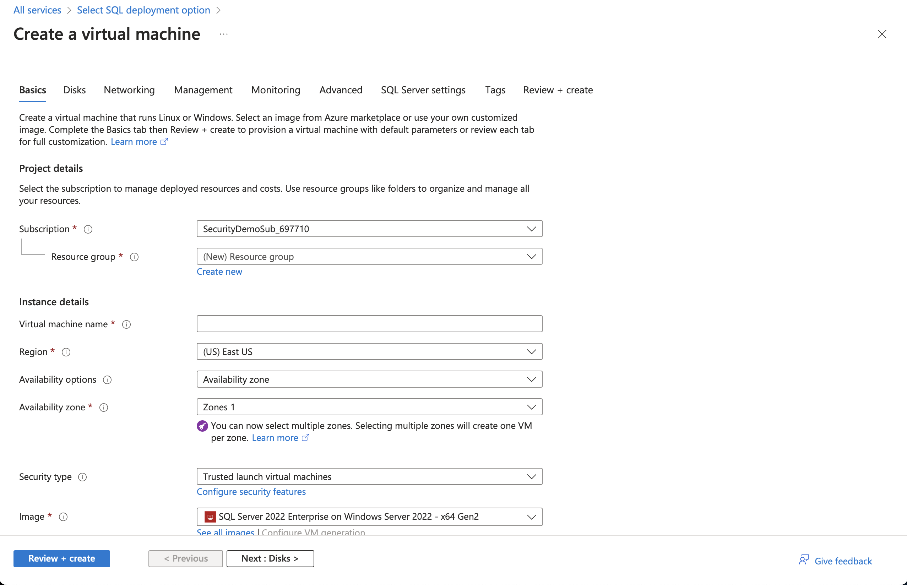
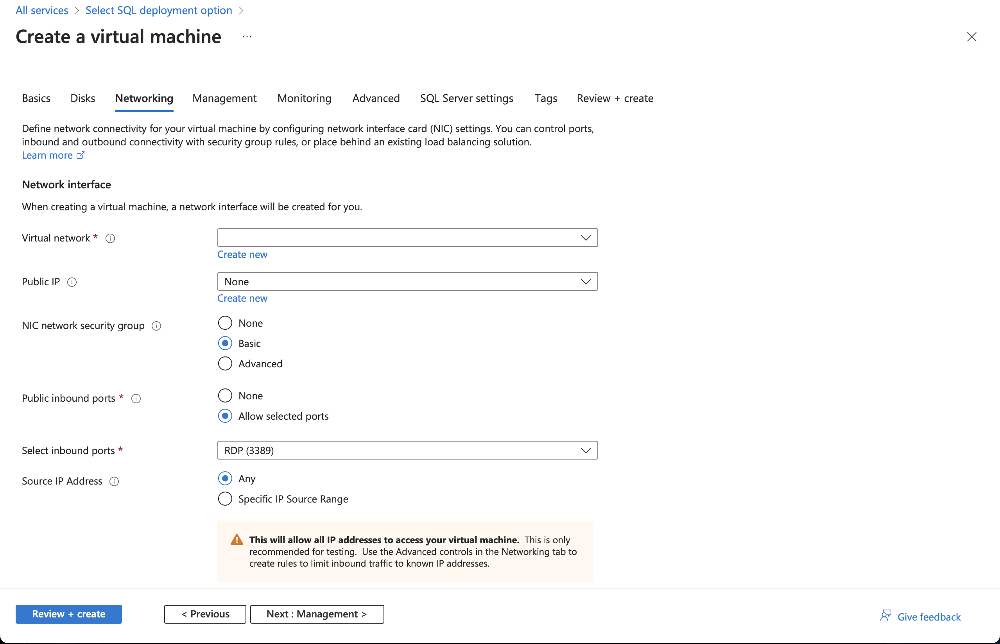
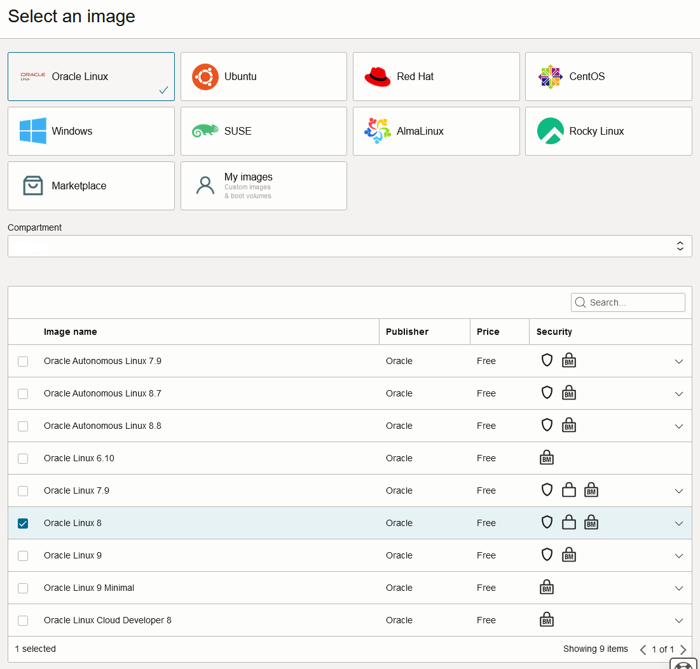
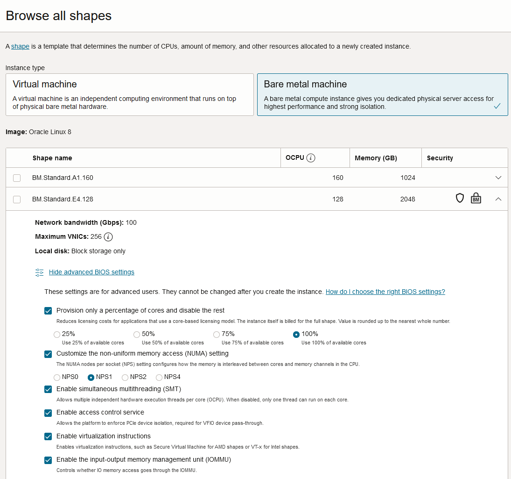
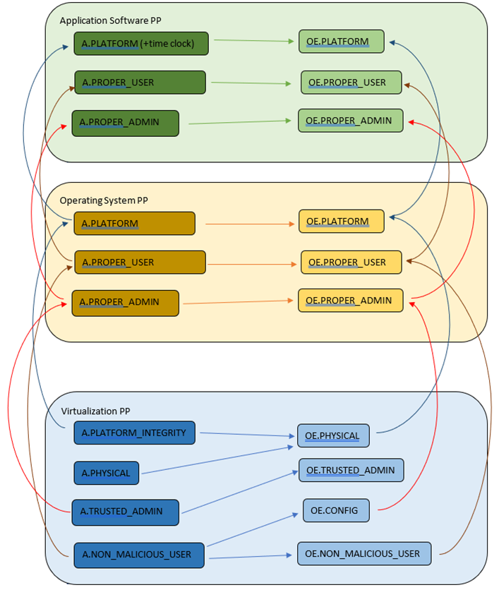

= _CC in the Cloud_ Guidance for Cloud Evaluations
:doctype: book
:title-logo-image: image:images/CCitCLogo.png[align=center]
:icons: font
:toc:
:revnumber: 1.0
:revdate: 2023-10-26

:iTC-longname: Common Criteria in the Cloud Technical Community 
:iTC-shortname: CCitC

== Preface

The Common Criteria (CC) in the Cloud (CCitC) Technical Community has developed this guidance document to provide a complimentary approach that allows for IT product evaluations in cloud operational environments. It includes instructions and examples of how to extend or develop Protection Profiles (PPs) for Target of Evaluation (TOE) deployments in cloud environments. This effort does not replace service-oriented frameworks or Cloud Authorization schemes.

The intended audience of this document are Protection Profile authors (e.g. iTCs and national TCs), but it may also be useful for cloud service providers, evaluators, evaluation authorities (schemes), labs, customers, and other stakeholders of these types of products. The expectations for the roles above are further discussed in section <<Roles Clarification>>.

This guidance introduces several concepts necessary to facilitate CCitC evaluations such as the trusted platform, as well as provides guidance to CC testing laboratories and CC schemes. However, it primarily covers three general areas:

* Updates to PPs
* TOE Identification
* CC Testing for Cloud Environments 

== Contributors

=== Lead Authors

Joshua Brickman (Chair) +
Matt Downey (CCUF liaison, NIAP Technical Lead) +
Brandon Harvey  (Technical Writer) +
Garrett Nickel (Record Keeper) +
Tyrone Stodart (ISO Liaison) +
Greg Youst (Deputy Chair) +
Justin Fisher

=== Contributors

Farid Ahmed +
Michael Angelo +
Josh Anzaroot +
Tom Benkart +
Maureen Barry +
Jennifer Brady +
Chris Brych +
Dani Chappell +
Tim Chevalier +
Cory Clark +
Erin Connor +
Brad Dispensa +
Jim Donndelinger +
Chris Enterline +
Roger French +
Tom Gallagher +
Shaun Geddis +
Anne Gugel +
Randy Heimann +
Jenn Honkofsky +
Anantha Kandiah +
Swapna Katikaneni +
Dylan Kehs +
Thibaut Marconnet +
Jerome Myers +
Andy Nissan +
Wolfgang Peter +
David Rumley +
Jade Stewart, PhD +
Alicia Squires +

=== Reviewers

King Ables +
Kelvert Ballantyne +
Shaun Gilmore +
Mike Grimm +
Matt Keller +
Kristy Knowles +
Ben Jacoby +
Elaine Newton +
Nithya Rachamadugu +
Simon Rix +

== Cloud Composition

When conducting Common Criteria evaluations for IT products in cloud environments, it is crucial to recognize that the Target of Evaluation (TOE) may be presented in a variety of deployment models. TOE products can be specifically designed to operate within the cloud natively, utilizing services and constructs that are only available within the cloud environment. They can also be deployed as self-contained products that are simply hosted on cloud infrastructure, otherwise known as “lift and shift." They may be a hybrid of both methods. The TOE will typically fall within the three primary cloud architecture models: Software as a Service (SaaS), Platform as a Service (PaaS), or Infrastructure as a Service (IaaS).

To further advance this concept, the following cloud architectures may be composed of Protection Profiles that are extended for a cloud context as shown below:

=== Software as a Service (SaaS)
[options=unbreakable]
This topology enables the SaaS Application (TOE) to run on cloud infrastructure where it is accessible from various client devices through either a thin client interface, such as a web browser (e.g., web-based email), or a program interface. The TOE does not manage or control the underlying cloud infrastructure including network, servers, operating systems, or storage.

The following PPs are examples which could be extended with CCitC guidance to cover the above use case: cPP_App_SW, cPP_DBMS, and PP_MDM.

For example, if the cPP for Application Software were to be used as a baseline, the cloud extensions may be applied to the existing TOE boundary and TOE platform as shown in the <<SaaS Example>>.

.SaaS Example
image::images/saas.png[SaaS Example]

In this example, the TOE relies on a TOE platform from an OS vendor which is hosted by the Cloud Service Provider (CSP) on the CSP's hardware. In this cloud evaluation scenario, additional requirements and assurance activities could be prescribed to expand the evaluated configuration in a cloud operational environment. 

=== Platform as a Service (PaaS)
[options=unbreakable]
This topology enables the deployment of applications onto cloud infrastructures. The TOE does not manage or control the underlying cloud infrastructures, including network, servers, operating systems, or storage, but has control over the deployed applications and possibly configuration settings for the application-hosting environment.

The following PPs are examples which might be extended with CCitC guidance to cover the above use case: PP_OS, and cPP_ND

For example, if the Protection Profile for General Purpose Operating System were to be used as a baseline, the cloud extensions may be applied to the existing TOE boundary and cloud operational environment as shown in the <<PaaS Example>>:

.PaaS Example
image::images/paas.png[PaaS Example]

In this example, the TOE relies on a cloud operational environment which is hosted by the CSP on the CSPs hardware. In this cloud evaluation scenario, additional requirements and assurance activities could be prescribed to expand the evaluated configuration to include a Cloud OE. 

=== Infrastructure as a Service (IaaS)
[options=unbreakable]
For this topology, the TOE is capable of provisioning processing, storage, network, and other fundamental computing resources where the TOE is able to deploy and run arbitrary software, such as operating systems and applications. The TOE does not manage or control the underlying platform but has control over operating systems, storage, deployed applications, and limited control of some networking components.

The following PPs are examples which might be extended with CCitC guidance to cover the above use case: PP_BASE_VIRTUALIZATION.

For example, if the Protection Profile for Virtualization were to be used as a baseline, the cloud extensions may be applied to the existing TOE Boundary and Cloud OE as shown in the <<IaaS Example>>:

.IaaS Example
image::images/iaas.png[IaaS Example]

In this example, the TOE provided by the IaaS provider relies on a cloud operational environment which is hosted by the CSP. In this cloud evaluation scenario, additional requirements and assurance activities could be prescribed to expand the evaluated configuration to include a cloud OE. 

== Shared Security Model

In the realm of cloud security, the shared security model is a fundamental concept that defines the division of responsibilities between the CSP and their customers within a cloud environment. This model generally provides that the CSP is responsible for securing the underlying cloud infrastructure, the customer bears the responsibility of securing their applications, data, and configurations within said infrastructure based on the service model. The shared security model recognizes that security is a collaborative effort, where both the CSP and the customer play crucial roles. This model is widely embraced in various cloud security frameworks, as it provides a clear model for understanding and allocating security responsibilities in a cloud environment. By delineating these responsibilities, the shared security model helps establish trust, accountability, and transparency between the CSP and the customer, ensuring a holistic approach to cloud security.

This concept is useful for CCitC evaluations as well and mirrors the relationship found with the TOE and TOE platform. To emphasize the enhanced requirements for Cloud Infrastructure we will refer to the shared responsibility model in terms of the TOE and the <<Trusted Platform>>.

=== Responsibilities

In the majority of use cases, the TOE administrator (the customer) is responsible for the secure utilization and customization of the cloud services provided by the CSP. This includes managing user access controls, configuring security settings, and implementing appropriate security measures aligned with their specific requirements. These elements may map appropriately to existing SFRs such as management functions defined by the FMT class in CC Part 2 (FMT_SMF) with or without refinement for CCitC. The TOE administrator ensures that the TOE (cloud tenant) operates securely within the parameters set by the CSP (TOE platform).

While the CSP maintains the security and availability of the TOE platform, the TOE administrator (customer) is assumed to be tasked with safeguarding their applications, data, and configurations within the cloud environment. They actively manage security controls, such as authentication mechanisms, encryption protocols, and network access policies, to protect their assets and mitigate potential risks.

The evaluation and assessment of the shared security model must consider both the TOE administrator (customer) and the TOE platform (CSP). The CSP, as the TOE platform, undergoes evaluation against relevant security standards, certifications, and best practices to demonstrate the effectiveness of the underlying cloud infrastructure's security controls. See the <<Trusted Platform>> section for more information on the required security assessments for the TOE platform.

Simultaneously, the TOE administrator (customer) is responsible for implementing and managing security controls and configurations within their own cloud environment. They utilize the provided security features, adhere to the CSP's policies and guidelines, and maintain appropriate security configurations to ensure the confidentiality, integrity, and availability of their data.

=== Evaluation of the Shared Security Model

There are certain areas where the shared security model can be somewhat blurred. For example, with many CC evaluations, the TOE or TOE Security Functional Interface (TSFI) is expected to exclusively generate TOE audit events. In the context of a virtualized network device deployed on a public cloud, certain CC requirements, such as FAU_GEN.1 (Audit Generation), would need to be modified to account for the use of logs provided by the Cloud Service Provider (CSP).

FAU_GEN.1 requires the TOE (virtualized network device) to generate audit records for security-relevant events. However, in a cloud environment, the CSP typically manages the underlying infrastructure and maintains centralized logging systems. As a result, the TOE may rely on the CSP's log management capabilities and use the logs provided by the CSP rather than generating its own audit records.

To accommodate this scenario, the collaborative protection profile for the virtualized network device on the public cloud should specify the requirements for log usage from the CSP's logging infrastructure. This would include defining the format, content, and frequency of logs to be provided by the CSP. Additionally, the protection profile should address the integrity and confidentiality of these logs during transmission and storage.

The modified CC requirements would then focus on the TOE's capability to securely receive, process, and analyze the logs provided by the CSP. The TOE should be able to extract relevant security events from the logs and correlate them with its own internal security policies. Furthermore, it should have the ability to raise alerts or initiate appropriate actions based on the analysis of the logs.

By adapting CC requirements like FAU_GEN.1 to encompass log consumption from the CSP, the protection profile enables the virtualized network device to leverage the logging capabilities provided by the CSP while maintaining compliance with CC requirements. This ensures that security-relevant events are properly logged, analyzed, and acted upon in the cloud environment, contributing to a comprehensive security posture for the virtualized network device.

Additionally, it may be important to add a third element to the shared security model for CCitC evaluations. This would be the inclusion of the TOE developer in addition to the TOE administrator and CSP. The TOE developer may be responsible for providing TOE security updates, maintaining a trusted update channel and infrastructure, or even applying these updates on behalf of the TOE administrator. This is a common feature with traditional SaaS use cases. In such cases where a TOE developer is expected to share responsibilities in the security model, PP authors must make the appropriate refinements, additions, or iterations of related elements in their PPs. This is a scenario that may be more common in TOE types that are meant to incorporate physical hardware into Cloud Infrastructure such as a Hardware Security Module (HSM). However, CCitC evaluations are not limited to a particular deployment model. Additionally, it is expected that there will be evaluations of TOEs that are integral to a CSPs cloud stack from hardware to application layers.

=== Administrator Guidance Documentation (AGD)

Ultimately, by designating the customer as the TOE administrator, the shared security model reinforces their active involvement in the secure administration of the cloud services. The CSP, as the TOE platform, provides the underlying infrastructure, while the TOE administrator assumes the responsibility of effectively configuring, managing, and monitoring the TOE to meet their specific security objectives and compliance requirements.

To ensure that TOE administrators who are familiar with Common Criteria but may have limited knowledge of cloud infrastructure and security can effectively manage the TOE within the shared security model, it is important for PP authors to adapt the AGD requirements accordingly. This includes providing clear instructions, accessible language, and practical guidance tailored to TOE administrators to help bridge the gap between Common Criteria expertise and the challenges of managing security in a cloud environment.

Additionally, the Security Target (ST) ASE requirements can be modified by PP authors to provide clear explanations that are tailored to evaluator's limited knowledge of cloud infrastructure and security. Such modifications may be appropriate for the  TOE Summary Specification (TSS) requirements and should include detailed information such that it is clear how the TSFI or Security Functional Requirement (SFR) enforcing features interact with the TOE platform in a cloud context. 

The TSS and AGD requirement's modifications provide clear and accessible guidance, empowering TOE administrators to make informed decisions, configure the TOE securely, and fulfill their security responsibilities effectively.

== Relationships Among the TOE, TOE platform, and the Trusted Platform

The following diagrams illustrate the relationships among these entities: 

While there may be functional differences between a TOE and a TOE platform in a cloud OE, the relationship between the two in providing SFR enforcing functionality is not changed for cloud-based evaluations. However, the TOE platform will require a hosting environment provided by the trusted platform.

Additionally, there may be cases that may require PP authors to provide additional selections for invoking either the TOE platform or the trusted platform for SFR enforcing functionality.

.TOE Platform
image::images/TOEPlatform.png[TOE Platform Example]

Not all evaluations of a TOE will rely upon a TOE platform. If the PP does not prescribe a TOE platform then the TOE must meet all mandatory SFRs independently. However, a trusted platform is still needed to provide a hosting environment. 

.Trusted Platform
image::images/TrustedPlatform.png[Trusted Platform Example]

As an example, for a Software Application, the TOE platform would be the Operating System and the trusted platform would be the underlying virtualization solution provided by the CSP.

If the TOE is a general purpose operating system (GPOS), then the TOE platform would be the underlying hypervisor and the trusted platform would include the hardware layer and below from the CSP.

If the TOE is a general purpose compute platform (GPCP), then no TOE platform is applicable and the trusted platform would be the power, cooling, and physical security provided by the CSP.

== Scheme Guidance

Scheme evaluation authorities should carefully review this guidance for any PP that is being used for an evaluation of a TOE in a cloud environment and confirm that there are no conflicts with existing evaluation authority policies. For example, a requirement for the evaluator to have the the TOE physically located or tested in their own facility. Although physical control is not practical for cloud evaluations, this does not mean that the lab is not in control of the cloud testing environment. If a lab provisions cloud platforms for testing, the appropriate controls for accreditation can be extended to their cloud testing environment.

Evaluation authorities should consider providing their own policies regarding trusted platform acceptance criteria in order to support the evaluation efforts. The PP should provide guidance for an evaluator to assess whether the cloud environment for the TOE satisfies the security objectives of the OE. This may likely include a mapping to Cloud Authorization Schemes that the evaluation authority may recognize as providing assurance that the security objective for the OE are met, and may provide input for an evaluation authority policy.

Evaluation authorities should review the evaluator evidence regarding the establishment of their cloud testing environment. This evidence should demonstrate that its environment establishes controls provided by the CSP to ensure effective isolation equivalent to on-prem testing thereby maintaining the integrity of results.

Evaluation authorities should review the PPs guidance around vulnerability testing as well and confirm that the evaluator has considered that guidance. The evaluator evidence should demonstrate that the evaluator was able to use cloud attack vectors. (e.g. service portal, management plane, etc. to complete the testing).

== Guidance for Evaluators

A PP should provide an evaluator with clear explanations tailored to an evaluator's perhaps limited experience of cloud infrastructure and security. Evaluators should aim to develop their knowledge and techniques for TOEs in the cloud to a comparable level to that for traditional on-prem TOEs.

Evaluators should read the PP’s explicit guidance for TOEs in a cloud environment. This appendix will include a mapping that an evaluator should use to confirm that a Cloud Authorization Scheme validated the selected trusted platform to have controls fulfilling the assumptions and associated security objectives for the operational environment. This will likely include a mapping that may be used by an evaluator to confirm that the selected trusted platform has been validated by an appropriate Cloud Authorization Scheme to have controls fulfilling the Assumptions and associated security objectives for the operational environment. This material should be reviewed and considered carefully. In the case where an evaluator considers that the material provided is insufficient or in error, the evaluator should contact the PP author for further discussion.

Evaluators should consider guidance in the Protection Profile regarding testing. An evaluator should prepare cloud testing infrastructure for the evaluation. This environment will establish controls provided by the CSP to ensure effective isolation equivalent to on-prem testing to maintain the integrity of results. This may involve isolated Virtual Local Area Networks (VLANs), Access Control Lists (ACL), Compute Resources, etc. on multi-tenant infrastructure. This information will need to be captured and presented to evaluation authorities as evaluation deliverables.

Evaluators should also consider vulnerability testing guidance in the PP. It may be the case that when applicable vulnerabilities are discovered or suspected for TOEs operating in a cloud environment, the evaluators may be required to use cloud attack vectors. (e.g. service portal, management plane, etc. to complete the testing).

== TOE Identification

When deploying a TOE to public cloud infrastructure, proper identification and distinction of the TOE instances are crucial. This ensures accurate tracking, management, and application of security controls specific to each TOE instance within the cloud environment. In this section, we will explain how TOE identification can be established when deploying TOE instances on popular public cloud platforms such as AWS, Azure, and Oracle Cloud Infrastructure.

Amazon Web Services (AWS):

In AWS, TOE instances can be provisioned as either bare metal instances or virtual machines (VMs) based on the specific requirements. AWS offers different services such as Amazon Elastic Compute Cloud (EC2) for VM instances and Amazon EC2 Bare Metal instances for bare metal deployment. During the provisioning process, unique identifiers such as instance IDs, resource tags, and naming conventions can be used to supplement TOE identification. By assigning descriptive tags and naming conventions, TOE administrators can easily distinguish and manage each TOE instance.

In the examples below, the configuration options for a compute instance are shown:

.AWS Example
image::images/aws1.png[AWS Example]

Operation system configuration:

.AWS Example
image::images/aws2.png[AWS Example 2]

Hardware configuration:

.AWS Example
image::images/aws3.png[AWS Example 3]

Azure:

In Azure, TOE instances can be created using Virtual Machines or Azure Dedicated Hosts for bare metal deployment. When deploying VM instances, Azure assigns a unique resource ID, which can be used for TOE identification. Additionally, Azure Resource Manager (ARM) tags and labels can be assigned to each TOE instance for effective identification and categorization. These tags can include metadata such as TOE name, version, environment, or any other relevant information that aids in TOE management and identification.

In the example below, a Database compute resource can be provisioned.

.Azure Example
image::images/azure1.png[Azure Example]

The database version along with the underlying operating system and version are specified in the interface shown below.

.Azure Example
image::images/azure2.png[Azure Example 2]

The virtual machine configuraiton is then  specificed in the following interface.

.Azure Example

Additional VM parameters are chosen.

.Azure Example
image::images/azure4.png[Azure Example 4]

VM networking configuration options may also be customized as seen here.

.Azure Example

Oracle Cloud Infrastructure:

Oracle Cloud Infrastructure (OCI) enables the deployment of TOE instances using Oracle VMs or bare metal compute shapes. OCI assigns a unique OCID (Oracle Cloud Identifier) to each compute instance, serving as a reliable identifier for TOE instances. Administrators can further enhance TOE identification by leveraging OCI's tagging system, which allows the assignment of user-defined tags. These tags can be used to categorize and identify TOE instances based on their specific attributes and requirements.

The following image displays the first steps in creating a compute instance.

.OCI Example
image::images/oci1.png[OCI Example]

Operating system verion and the corresponding images may be used, or a custom image can be provided.

.OCI Example

Hardware configuration options for creating the instance as a VM or as a Bare Metal server.

.OCI Example

By utilizing unique identifiers, resource tags, naming conventions, and metadata labels provided by the respective cloud platforms, TOE identification can be effectively established in public cloud infrastructure deployments. These identification mechanisms aid in maintaining clear visibility, control, and management of TOE instances, enabling administrators to enforce security controls and monitor the specific security posture of each deployed TOE instance within the public cloud environment.

== Cloud Equivalence Considerations

When writing Security Targets, the Cloud Service Offering (CSO) must be detailed in the TOE evaluated configuration and shall include the cloud region and/or applicable datacenter. CSOs offered by the same CSP cannot inherently be assumed to be equivalent. For instance, CSPs may have separate environments among government or commercial customers with differing security capabilities. Therefore, an equivalency rationale must be made to claim multiple CSO compatibility with the evaluated configuration. However, if cloud authorizations exist for multiple regions or datacenters in which a CSO is found to meet similar requirements constistently this may be leveraged as equivalency rationale. In addition, each CC scheme has the option to define a policy for acceptance criteria.

=== CPU Equivalency 

In evaluating IT products within a cloud context, precision and consistency in labeling OEs are of paramount importance. This section outlines the essential guidelines for labeling OEs according to the specific characteristics of the technology stack involved. This guidance aligns with the Cryptographic Module Validation Program (CMVP).

Applicable guidance shall be followed when labeling OEs such as:

* TOE version XX.YY on OS version X.Y on CPU model Z
* TOE version XX.YY on Hypervisor version X.Y on CPU model Z
* TOE version XX.YY on Hypervisor version X.Y on OS version X.Y on CPU model Z

TOEs that are being evaluated in a cloud context are expected to be able to conclusively demonstrate knowledge of the underlying TOE platform for these specifics. If SFR enforcing functionality is agnostic to the TOE platform, such equivalency claims may be made, such as when all entropy is utilizing a Jitter entropy source which exists only in the OS User Space. However, if the TOE is relying on the TOE platform for any SFR enforcing functionality, then the TOE must be able to conclusively demonstrate knowledge of the underlying TOE platform for this functionality.

At this time, if a TOE is reliant on the OE for cryptographic operations, there is no need to leverage collateral, such as cyptrographic module validations, that explicitly states operation for a Cloud Provider. This equivalence rationale should be considered when a TOE developer is reliant upon a CSP for algorithm certification and many TOE platforms are claimed.

== Protection Profile Considerations

The following section provides a high-level overview for adapting CCitC methodology to existing PPs, including examples where appropriate. This approach is predicated on determining the suitability of a PP for cloud evaluations. Considerations were given to the security problem definition, security objectives, and security requirements are affected by cloud evaluations, and how these evaluations may relate to other cloud authorization schemes recognized by national certification bodies.

=== Procedure for Deriving Cloud Evaluation Guidance for a PP or PP-Module

==== Process Overview

In adapting a PP to cloud evaluations there are several things that a PP author must consider. These include: 
* Determining whether the technology has a cloud use case to begin with (suitability check).
* Determine the extent to which a conformant TOE aligns to national or international requirements for cloud security.
* Determine whether any SFRs or evaluation activities need to be added or modified for cloud use cases.
* Determine how the chosen cloud requirements can be leveraged to ensure that the TOE is deployed in an environment that adequately meets the PPs assumptions and organizational security policies.

==== Suitability Check

Identify whether the product type can reasonably operate in a cloud context and what the cloud use case for it is. Some examples as follows:

* The Mobile Device Management Protection Profile (MDM PP) explicitly states that an MDM Server can be deployed in a cloud setting so this is an obvious candidate to consider.
* The collaborative Protection Profile for Network Devices (NDcPP) defines virtual network devices as a use case, which can be virtualized as a service in a cloud deployment so this is another obvious example.
* The collaborative Protection Profile for Hardcopy Devices (HCD cPP) defines the capabilities of a specific multifunction device such as a printer. Since this exists solely as a physical device, there is no cloud use case for it.

Note that most existing PPs do not currently define cloud use cases. This will need to be done on a per-PP basis so that it is clear which types of products can be deployed in cloud settings and so that the technical community can make clear what the expectations are for the product’s intended usage and environmental protections. For example, with respect to the NDcPP, the existing security problem definition and environmental security objectives may not cover the case where a network device is deployed as a cloud platform or infrastructure device. The potential cloud use cases for individual product types must be considered as part of determining a PP’s suitability for supporting cloud evaluations. It is recommended that PP authors consult with product vendors for the technology type to determine  whether cloud use cases exists.

Note that the mapping activities below may help a technical community determine whether a PP is capable of supporting cloud evaluations as-is or whether changes to that PP would be needed. This in turn would help determine whether evaluating a particular product type in a cloud setting is actually feasible.

==== Choose Cloud Standard and Security Controls for Mapping 

Different nations use different standards, methodologies, and assessment schemes for approval of cloud infrastructure, platforms, and software. This may tie into more general security controls that can be examined. For example, the U.S. standard NIST SP 800-53 defines security controls for information systems across physical, personnel, procedural, and technical domains. The FedRAMP authorization process ensures that cloud infrastructure, platforms, and software can be deployed in a manner that satisfies the 800-53 security controls that the program considers to be relevant to cloud systems. FedRAMP defines Low, Moderate, and High assessment baselines with hierarchical controls. In the MDM example discussed throughout this document, FedRAMP will be used as the cloud authorization scheme for reference.

The goal of this exercise is to attempt to answer the following questions:

* Is the environment where the TOE is deployed capable of meeting the assumptions for the operational environment that the PP or PP-Module defines? That is, if the TOE is deployed on a platform or infrastructure that has been ‘certified’ through some separate cloud authorization program, is that sufficient to say the OE is suitable for CC, or would additional assurances be needed? 

* Are there any obvious gaps in the PP or PP-Module where requirements or tests would need to be added or modified specifically for the case of a cloud deployment?

Once these questions have been answered for a particular cloud evaluation methodology, the idea is that the same logic could be applied to any other such methods that are used by other Common Criteria Recognition Arrangement (CCRA) members. 

==== Create an Outline for Mapping

Complete a mapping document (e.g. spreadsheet) that lists out each of the following items in the PP or PP-Module being examined:
* SFRs
* Assumptions 
* Security Assurance Requirements (SAR)s

A template for the mapping document along with a completed sample for the MDM PP is included as an appendix to this document.

The sections below identify the process by which these should be aligned with the chosen cloud authorization scheme. 

==== Identify the SFR Impact on Cloud Deployment

Each SFR in the PP or PP-Module is likely written in such a way that assumes on-premise deployments are used for the TOE. Analysis of the SFRs and their corresponding evaluation activities must be done to determine the impact of deploying a product in a cloud environment. Specifically:

* Are there any SFRs that allow “TSF vs TOE platform” selections to be made and if so, does the nature of how the TOE platform implements the function change based on whether the TOE platform is cloud-based versus on-premise? For example, a general-purpose operating system in a cloud environment may rely on data-at-rest protection that is provided by an underlying storage volume. 

* Are there any evaluation activities that must be executed differently in a cloud environment, and does this potentially change based on the CSP being used?

** For example, a software application may rely on cryptographic services provided by a host operating system that runs on some physical hardware. When this application runs in a cloud environment, the end user of the application is not responsible for the physical hardware. Therefore, knowledge of the potential hardware that the CSP makes available to the end user must be known so that all possible use cases for hardware processing of cryptographic functions can be assessed.

* Are there any evaluation activities that cannot be performed as written when the TOE is deployed in a cloud environment, or that can only be performed with special accommodations? For example, Transport Layer Security (TLS) testing requires extensive manipulation of network traffic and a CSP may automatically deploy a traffic filtering firewall that discards invalid traffic before it can even reach the TOE. Depending on the test environment, it may require coordination with the CSP to ensure that the operational environment is configured in such a way that the evaluator can verify that the TOE is performing the required function rather than an environmental component.

** If there are any evaluation activities that cannot be performed as written for a cloud evaluation, the PP author must provide alternative guidance for how the evaluation activity may be modified to show that the requirement is adequately met in a cloud environment. The PP author must write any cloud-specific evaluation activities in a manner that is sufficiently generic to be achievable regardless of the CSP being used. Evaluation activities should not implicitly ‘endorse’ a given set of CSPs by virtue of being the only ones for which guidance exists.

** It may be the case that a requirement simply does not apply to a cloud environment, in which case the PP author could consider defining that requirement as an implementation-based SFR that applies only to the on-premise use case.

* Are there any critical functions that are missing because of the PP or PP-Module’s current expectation that the TOE is deployed in an on-premise environment? If so, PP authors should work with technical subject matter experts to define implementation-based SFRs that apply only to the cloud use case such that the desired functionality can be covered in this situation.

////
Placeholder for example SFR
////

Note that mappings to the desired cloud authorization schemes are not critical here, at least not from a CC perspective. The expectation is that if the TOE has already been validated against a cloud authorization scheme, there will be little to no re-use of that evidence because of how tailored the CC requirements are to specific tests. There may be some value to vendors pursuing cloud certification after a CC evaluation because the specific evidence could be reusable in a more general context, but the relationship likely does not flow both ways.

==== Determine Appropriateness of Security Problem Definition

The Security Problem Definition (SPD) of a PP or PP-Module defines the threats the TOE faces, the assumptions about the TOE’s operational environment that bounds these threats, and any organizational security policies the organization deploying the TOE may implement to help mitigate the threats in a way that the TOE cannot explicitly enforce (e.g. by defining a password policy that is stronger than what the PP or PP-Module requires).

The purpose of this activity is to consider what an appropriate operational environment would be for the TOE in a cloud setting based on the assumptions defined in the PP. In the context of cloud evaluations specifically, it is important for the end user to have confidence that these assumptions are adequately met since not all aspects of the operational environment will be in their direct control.

To determine the appropriateness of the existing SPD, the PP author should perform the following steps:

* For each assumption in the PP or PP-Module, determine whether it applies to any cloud-specific use cases. If the assumption is not affected by a cloud deployment, then no further consideration is needed for it. 

** Example: If there is an assumption that an environmental component is configured to communicate with the TOE to receive information from it, this is not cloud-specific because an environmental component outside of the cloud is responsible for that configuration.

* If the assumption does apply to cloud-specific use cases, determine if it is decomposed to the most granular level or it is a more general statement that could be made more granular. It is important to decompose assumptions to their lowest level so that all applicable security controls can be considered in the context of whether a cloud authorization of the environment is sufficient to demonstrate that it can satisfy the assumptions.

** Example: An assumption that the TOE is protected by a network boundary device (e.g. firewall) is granular.

*** On the other hand, a general assumption that administrators are non-malicious is not granular because there are several ways in which malicious administration can be safeguarded against. This can be made more granular by further breaking it down into assumptions that privilege escalation by non-administrators is prevented, such as by physical security controls on the infrastructure, adequate credential protection, adequate enforcement of logical data separation mechanisms, and routine penetration testing against the overall system to ensure the continuous authorization of these things. It can also include background checks or other vetting of administrators and split control that requires approval of administrative decisions.

* Once all the assumptions related to cloud deployments are listed out in their most granular form, review the chosen cloud scheme for any areas of overlap.

** Example: For the non-malicious administrator assumption outlined above and using Federal Risk and Authorization Management Program (FedRAMP) as the chosen cloud authorization scheme, the following NIST SP 800-53 controls that are used in FedRAMP can be used to show that those assumptions are met by the environment:

*** Credential protection: IA-5, part of FedRAMP Low
*** Physical protection: PE-1 through PE-4, part of FedRAMP Low (1 through 3) and Moderate (4)
*** Logical data separation: SC-4, part of FedRAMP Moderate
*** Penetration testing: CA-8, part of FedRAMP Moderate
*** Background checks: PS-3, part of FedRAMP High
*** Split control: AC-3(2), not part of any FedRAMP baseline

The goal here should be to make a statement that asserts whether an existing cloud authorization program is sufficient to validate that the cloud portion of the TOE’s operational environment is a “trusted platform” or whether it would need to be supplemented with additional evidence. Additionally, if the chosen authorization program has multiple levels, types, or other distinguishing factors, the relevant one should be considered. 

* Example: FedRAMP High plus supplementing with NIST control AC-3(2) would be needed to provide assurance that the trusted administrator assumption would be met in the TOE’s chosen operational environment, based on the analysis above.

In the context of software, if one reviews the SPD and can determine that all assumptions on the operational environment are covered by 800-53 security controls that are assessed as part of the FedRAMP Moderate baseline, they could assert that using platform and infrastructure components certified against this baseline would be sufficient to conclude that the chosen operational environment is suitable. In the case of a platform, the same process could be followed, except that only the infrastructure would need to be examined since that is the operational environment for the platform. Lastly, in the case of infrastructure, the non-technical aspects of the underlying cloud service provider (physical, personnel, and procedural controls) would be examined for the suitability of the operational environment.

Many PP assumptions are similar if not identical among PPs. For example, assumptions regarding trusted administrators or physical protection of the TOE are generally present in PPs with very similar wording among them. The MDM PP is no exception. The decomposition and mappings done for this PP could potentially be usable in other PPs without needing to come up with separate rationale for what is essentially the same process.

Additionally, there are some assumptions (addressed by operational environment objectives) that are specific to cloud environments and do not apply to on-premise use cases. Existing PPs, therefore, do not have any reference to these since they were not written with cloud evaluations in mind. The CCitC technical community has compiled some sample assumptions and environmental objectives that could be considered for inclusion in PPs that support cloud evaluations; these are listed in <<Appendix A: Threats, Assumptions and Security Objectives for each PP>> below. Note that this approach is similar to the NDcPP, which has assumptions and environmental security objectives that only apply in certain situations, such as when the TOE is distributed or when the TOE is virtualized. 

Note that the shared security model must be considered when looking at assumptions. Responsibility for secure deployment and configuration of the TOE may involve collaboration of up to four different groups (infrastructure vendor, platform vendor, software vendor, and end user). The roles and responsibilities must be considered on a PP or PP-Module level because the trusted personnel will differ based on what layer of the cloud stack the TOE sits on. This may vary from vendor to vendor or from product to product. For example, a CSP deploying its own software on its own cloud infrastructure may only have a single point of contact on its end and there are no cross-organizational concerns.

==== Determine Impact on SARs
While the number and level of SARs can vary widely depending on the scheme or organization authoring the PPs and PP-Configurations, the SARs from the MDM PP can serve as an initial minimal baseline for how a cloud evaluation affects the evidence that laboratories will be expected to produce. The extent to which a cloud evaluation affects this evidence is not expected to vary by technology type, but further analysis of individual PPs would be needed to confirm this. 

For example, when the TOE is evaluated in the cloud against the MDM PP, additional installation guidance may be needed for initial deployment in a given CSP. However, this is expected to be true of other PPs as well and not something that only affects MDM products specifically.

This process was followed for the MDM PP to determine how evaluation activities for its SARs would be affected in the case where a TOE is evaluated in the cloud. The following are considerations for PP authors on how to incorporate cloud evaluation guidance into SAR evaluation activities:

* Class ASE (Security Target) – PP authors should make it clear that any cloud-based evaluation of the TOE should clearly state the operational environment in which the TOE was tested to the greatest degree that is feasible. This is expected to include the claimed CSPs, regions, and hardware machine pools where applicable. If the CSP has functionality that the TOE relies on to support the enforcement of its security claims, such as data-at-rest protection, these should be referenced in the physical boundary of the TOE as security-relevant interfaces to the cloud.

** On an individual SFR level, if the method by which the TOE meets an SFR differs when it is being evaluated in the cloud, the PP author must ensure that evaluation activities have appropriate guidance for what the Security Target needs to document when making these claims. Any implementation-based SFRs that are only claimed when the TOE is evaluated in the cloud or only when it is evaluated on-premise must also indicate clearly when those SFRs are expected to apply.

* Class ADV (Development) – Since the TOE’s evaluation in the cloud may rely on other cloud services to support the enforcement of the TOE’s claimed security functionality, PP authors should ensure that discussions on the TOE’s interfaces to the cloud are described in the context of the functional specification. If the required ADV SARs include a TOE design specification or architectural description, PP authors should provide guidance as to what is necessary to document about how the cloud version of the TOE differs from a traditional on-premise architecture.

* Class AGD (Guidance) – Preparatory procedures will differ significantly between cloud-based and on-premise TOEs. The PP author must provide guidance for the preparatory procedures that are needed for the TOE to be deployed in its claimed cloud environments. This may involve separate sections for separate CSPs if multiple CSPs are claimed in the evaluated configuration. The guidance may assume that the intended reader has basic familiarity with deploying cloud products; the PP author’s focus should be to ensure that developers understand the need for the guidance to instruct users on how to replicate the evaluated configuration to the greatest extent possible.

* Class ALC (Lifecycle) – The TOE and its operational environment cannot be assumed to be static in a cloud environment. Identification of both the TOE and its operational environment is critical for the user to understand the tradeoffs among compliance with the evaluated configuration of the TOE and any subsequent security or feature enhancements that may be made after it has been certified. PP authors are encouraged to include lifecycle evaluation activities for how the TOE and its environmental dependencies are identified in the evaluated configuration and how updates are delivered both to the TOE and to its underlying operational environment. It may be the case that the CSP is responsible for back-end updates to the TOE’s operational environment. The PP author should emphasize that this be clearly expressed in the life cycle documentation so that the evaluation laboratory can evaluate how the TOE developer takes these environmental changes into consideration when managing the product's life cycle and how such changes are communicated to end users.

* Class ATE (Testing) – As discussed previously, functional testing of SFR claims may or may not be different when the TOE is evaluated in the cloud. For cases where on-premise and cloud evaluation of a given SFR may differ, the PP author is expected to provide clear guidance as to the evaluation activities that are different for each use case.

* Class AVA (Vulnerability Analysis) – A vulnerability analysis of a cloud product may involve many dependencies that the TOE relies on in a way that an on-premise TOE may not be able to. Frequent changes to environmental configuration on the CSP side may not be in the control of end users and will continually change the versions of dependent components that the TOE relies upon. PP authors should provide guidance to evaluators to identify the dependencies that the TOE has in the cloud (for each claimed CSP) and conduct vulnerability research on the latest versions of those dependencies, as well as any potential vulnerabilities that are specific to the claimed CSPs. Additionally, guidance for penetration testing should be given with the understanding that the TOE may not be deployed in a fully closed environment and as such there may be limitations on the rules of engagement that must be followed with the CSP. It is expected that evaluation schemes will provide guidance on the penetration test efforts that will be accepted for cloud evaluations, and PP authors should incorporate such guidance into PPs for consistency.

The high-level takeaways from this are as follows:

* The same notion of needing the operational environment to be a “trusted platform” applies here – deploying the TOE in a cloud platform and infrastructure has undergone a third-party authorization is important because it helps the evaluator understand the extent to which the TOE relies on the platform and assures that a vulnerable platform does not introduce any significant potential exploits of the TOE itself.

* The impact of a cloud deployment on how the TOE is evaluated is generally not going to be specific to a particular PP or PP-Configuration; following general CCitC guidance for this should be suitable in most cases.

==== Map to Other Applicable Cloud Programs

Once the assumptions for the TOE’s operational environment are mapped to the referenced cloud certification scheme to determine what can be considered a 'trusted platform' for the TOE, and the SFRs and SARs have been assessed to determine how cloud deployment affects the certification process. The output of this assessment can be mapped to other cloud certification programs.

If starting with FedRAMP, a non-U.S. cloud certification scheme will not use NIST SP 800-53 to associate security controls with required system behavior, but such a scheme would likely have significant overlap, just with a different naming scheme. 

This process should be applied to any nations that wish to support the use of CCitC but first need to understand how such a certification would fit in to their existing certification programs.

==== Conformance Claims

It is not expected that changes would be required to the Conformance Claims chapter. 

PP editors may consider including a reference to this guidance document within the updated PP.

==== Security Problem Definition

This chapter describes security problems in terms of threats, assumptions, and organizational security policies.

Appendix A details the threats, assumptions, security objectives for the TOE, and security objectives for the operational environment for a number of PPs of interest.

In Appendix B, specific aspects of the assumptions and security objectives for the operational environment were considered to determine whether assumptions made for each PP of interest are consistent and could be satisfied by a cloud environment. The analysis found that the assumptions and security objectives for the OE for PPs of interest are consistent: There are generally only three categories: Platform Integrity, Proper (Non-Malicious) User and Proper (Trusted) Admin. The virtualization PP additionally considers Physical Security but this is not considered by the other PPs.

It is not expected that a cloud environment will introduce new threats, assumptions, or organizational security policies. However, the PP writers may wish to consider whether existing threats, assumptions, and organization security policies should be refined to provide more explanation in the case of cloud.  For example, threat models may consider the impact of potential ubiquitous access and multi-tenancy to either add to existing threats, assumptions, and organizational security policies or refine them.

==== Security Objectives

Security objectives for the TOE map to security functionalities or services of the TOE itself so it is not expected that changes would be required.

As described in Appendix B of this document, the security objectives for the OE provide the general requirements that should be satisfied by the cloud environment. It is proposed that PPs should include an appendix as guidance for an evaluator to assess whether the cloud environment for the TOE satisfies the security objectives for the OE of the PP. In the context of the PP’s highlighted, where the assurance level is low (no development security requirements, vulnerability requirements at AVA_VAN.1: public search), the assumptions and Security Objectives for the OE should be sufficiently satisfied by any suitable cloud security certification process recognized by a national government supporting Common Criteria, that addresses the environment being used (e.g. lowest level FedRAMP, BSI C5 baseline, ISO27017).

The security objectives rationale is not expected to change, unless additional threats, assumptions, or security objectives have been added.

==== Key Takeaways

Conceptually, a PP or PP-Configuration should allow a TOE to be evaluated in a cloud deployment. 

However, not all clouds are created equal. Some method is needed to ensure that if the TOE depends on a cloud platform or infrastructure, there is sufficient trust in its security to say they are eligible to be used as the TOE’s operational environment.

While cloud authorization of the environment is an essential part of gaining sufficient trust to deploy the TOE in a cloud setting, such an authorization of the TOE itself, may only offer minimal value in terms of evidence reuse. This is due to the specific granularity of CC evidence. However, the benefits may flow the opposite direction; due to the high level of rigor of a CC evaluation, the evidence from such a certification could potentially be reused for a higher-level cloud certification.

On a general level, the CC in the Cloud technical community is developing guidance documentation that should be usable across all  CC cloud evaluations that covers the cloud-specific requirements for operational and preparatory procedures. Such guidance should be applied uniformly across all PPs to ensure consistent presentation across technology types.

At a per-PP level, technical communities will need to determine several key factors such as:

* The underlying assumptions that the TOE relies on a cloud service provider to satisfy. 
* The extent to which existing SFRs can be tested in a cloud setting.
* Any workarounds or updates required for tests that cannot be strictly performed as written. 
* Any cloud-specific SFRs that need to be added as implementation-dependent requirements. 

This ensures that cloud-specific threats are adequately mitigated.

Security best practices are well-established principles and the cloud authorization schemes used by different nations should have significant overlap. Once the applicability of one authorization scheme is assessed as a reference, the process for adapting this to other such schemes should be straightforward. Ultimately the buy-in of individual CCRA participants will affect the cloud authorization schemes that need to be assessed for a given PP or PP-Module.

== CCitC Suggested Inputs to a Security Problem Definition

In the case where a TOE is hosted on a trusted platform, platform related Assumptions and associated Security Objectives for the OE should be fulfilled by that trusted platform.

Below are a suggested set of Assumptions and security objectives for the OE that may be incorporated into a PP. The table provides a mapping between them and also to <<CiscoCCFv2>>, which provides further mapping to individual cloud authorization schemes. Such mapping in a Protection Profile may be used by an evaluator to confirm that the selected Trusted Platform has been validated by an appropriate Cloud Authorization Scheme to have controls fulfilling the assumptions and associated security objectives for the OE. 

Threats are not considered here since they map to security objectives for the TOE rather than assumptions and security objectives for the OE. A threat, as an adverse action performed by a threat agent on an asset, is not contextual to the OE of the TOE. However, an author may choose to review the listed threats detailed in a PP in the context of cloud evaluations.

It should be noted that the these suggested additions for a TOE hosted on a trusted platform does not necessarily replace all the assumptions and security objectives for the OE. For example, assumptions around restrictions on general-purpose computing capabilities, not providing through traffic protection, trusted admin at the level of the TOE, non-malicious/trusted/proper users, and TOE updates are unlikely to be fulfilled by the trusted platform.

=== A.TRUSTED_PLATFORM_ADMINISTRATOR 
The Security Administrators for the trusted platform are assumed to be trusted and to act in the best interest of security for the organization. This includes not interfering with the correct operation of the TOE. The TOE is not expected to be capable of defending against a malicious trusted platform administrator that actively works to bypass or compromise the security of the TOE.

=== OE.TRUSTED_PLATFORM_ADMINISTRATOR 
Trusted Platform Security Administrators are trusted to follow and apply all guidance documentation in a trusted manner. 

=== A.TRUSTED_PLATFORM_CONNECTIVITY
All connections to and from trusted platforms and between separate parts of the TSF are physically and/or logically protected within
the trusted platforms to ensure the integrity and confidentiality of the data transmitted and to ensure the authenticity of the communication end points.

=== OE.TRUSTED_PLATFORM_CONNECTIVITY
All network and peripheral cabling shall be approved for the transmittal of the most sensitive data transmitted over the link. Such physical links are assumed to be adequately protected against threats to the confidentiality and integrity of the data transmitted using appropriate physical and logical protection techniques.

=== A.TRUSTED_PLATFORM_ISOLATION
It is assumed that the Trusted Platform provides, and is configured to provide, sufficient isolation between software running in Trusted Platforms on the same physical platform. Furthermore, it is assumed that the Trusted Platform adequately protects itself from software running inside Trusted Platforms on the same physical platform.

=== OE.TRUSTED_PLATFORM_ISOLATION
The trusted platform isolation is configured to reduce the attack surface of the TOE as much as possible while supporting TOE functionality. The isolation is operated in a manner that reduces the likelihood that TOE operations are adversely affected by virtualisation features such as cloning, save/restore, suspend/resume, and live migration. If possible, the isolation should be configured to make use of features that leverage the virtualisation privileged position to provide additional security functionality. Such features could include malware detection through VM introspection, measured VM boot, or VM snapshot for forensic analysis.

=== A.TRUSTED_PLATFORM_PHYSICAL_PROTECTION
The TOE is assumed to be physically protected in its Trusted Platform environment and not subject to physical attacks that compromise the security or interfere with the TOE's physical interconnections and correct operation. This protection is assumed to be sufficient to protect the TOE and the data it contains. As a result, there are no further requirements on physical tamper protection or other physical attack mitigations. The TOE is not expected to defend against physical access to the TOE that allows unauthorized entities to extract data, bypass other controls, or otherwise manipulate the TOE. 

=== OE.TRUSTED_PLATFORM_PHYSICAL_PROTECTION
Trusted platforms that operate within data centers or in other access-controlled environments, are expected to receive a considerable degree of protection from these environments. In addition to physical protection, these environments often provide malware-detection and behaviour-monitoring services for computing assets.

=== A.TRUSTED_PLATFORM_REGULAR_UPDATES 
The trusted platform software/firmware is assumed to be updated by the Trusted Platform Administrator on a regular basis in response to the release of product updates due to known vulnerabilities.

=== OE.TRUSTED_PLATFORM_REGULAR_UPDATES
The trusted platform software/firmware is updated by a Trusted Platform Administrator on a regular basis in response to the release of product updates due to known vulnerabilities.

=== A.TRUSTED_PLATFORM_RESIDUAL_INFORMATION
The Trusted Platform Administrator must ensure that there is no unauthorized access possible for sensitive residual information (e.g. cryptographic keys, keying material, PINs, passwords, etc.) on platform equipment when the equipment is discarded or removed from its operational environment.

=== OE.TRUSTED_PLATFORM_RESIDUAL_INFORMATION
The trusted platform ensures that there is no unauthorized access possible for sensitive residual information (e.g. cryptographic keys, keying material, PINs, passwords, etc.) on equipment when the equipment is discarded or removed from its operational environment. 

=== A.TRUSTED_PLATFORM_SERVICE
The TOE relies upon a trustworthy platform and local network from which it provides administrative capabilities.

The TOE relies on this platform to provide a range of security-related services including reliable timestamps, user and group account management, user authentication, user authorization, logon and logout services via a local or network directory service, remote access control, and audit log management services to include offloading of audit logs to other servers. The platform is assumed to be configured specifically to provide TOE services, such as a host-based firewall, which limits its network role to providing TOE functionality.

=== OE.TRUSTED_PLATFORM_SERVICE
The TOE relies upon a trustworthy computing platform for its execution. This includes the underlying operating system and any discrete execution environment provided to the TOE. The trusted platform service shall be managed according to known, accepted, and trusted policies. Any information provided by the trusted platform and used to support user authentication and authorization used by the TOE is correct and up to date.

=== OE.TIMESTAMP
Reliable timestamp is provided by the operational environment for the TOE.

.Rationale for Environmental Security Objectives and Cloud Authorization Scheme Controls
[options="header"]
|=======================
|Assumption|Environmental Objective Addressing
the Assumption      |Cloud Authorization Scheme Controls - Cisco CCF v2.0
|A.TRUSTED_PLATFORM_ADMINISTRATOR    |OE.TRUSTED_PLATFORM_ADMINISTRATOR      |111, 141, 142, 144, 145, 146, 152, 153, 159, 169, 198, 199, 200
|A.TRUSTED_PLATFORM_CONNECTIVITY    |OE.TRUSTED_PLATFORM_CONNECTIVITY      |104
|A.TRUSTED_PLATFORM_ISOLATION    |OE.TRUSTED_PLATFORM_ISOLATION      |173, 215, 223
|A.TRUSTED_PLATFORM_PHYSICAL_PROTECTION    |OE.TRUSTED_PLATFORM_PHYSICAL_PROTECTION      |42, 43, 44, 59, 60, 207
|A.TRUSTED_PLATFORM_REGULAR_UPDATES    |OE.TRUSTED_PLATFORM_REGULAR_UPDATES      |310, 314, 315
|A.TRUSTED_PLATFORM_RESIDUAL_INFORMATION    |OE.TRUSTED_PLATFORM_RESIDUAL_INFORMATION      |63, 80, 81, 82, 83
.2+|A.TRUSTED_PLATFORM_SERVICE 
|OE.TRUSTED_PLATFORM_SERVICE      |70, 76, 107, 108, 117, 140, 160, 276, 280, 310, 311, 318
| OE.TIMESTAMP      |212
|=======================

=== Guidance Documentation

If there is existing documentation for a CSP it should be leveraged. Each CSP that is tested shall provide instructions for deployment of the TOE. Consultants and vendors shall provide necessary supplemental guidance as it supports deploying the TOE as evaluated in the cloud. In addition, functionality that is included but not evaluated shall be clearly identified. 

It is important to distinguish here that not all expected elements of a traditional AGD document can be translated for Cloud Environments. It may be necessary to exclude or supplement these guidance requirements depending on the topology of the product and the cloud service provider. In some circumstances, the Cloud Provider is the only entity that may fulfill these guidance requirements to ensure that the TOE is deployed in the tested configuration.

== Guidance For Test Environments on Cloud Infrastructure

As Common Criteria testing requires isolated test environments for each TOE to prevent contamination of test results, testing on Public Cloud infrastructure raises some unique challenges. 

An evaluator should be prepared to create and offer cloud testing infrastructure to TOE developers. This environment must establish controls provided by the CSP to establish effective isolation equivalent to on-prem testing to ensure the integrity of results. This may involve isolated VLANs, ACLs, Compute Resources, etc. on multi-tenant infrastructure. This information will need to be captured and presented to Evaluation Authorities as evaluation deliverables. 

In general, the necessity to abstract from underlying hardware layers is dictated by the TOE type in Protection Profiles. For instance, the cPP for Application Software relies only on the underlying OS and makes no distinction on whether that OS is virtualized. In this scenario bare metal isolation in the cloud testing would be unnecessary and  a multi-tenancy environment is acceptable. 

== Vulnerability Assessment Methodology

In general, the AVA methodology shall be sufficient for most TOE types. However, certain edge cases may present themselves. 

As we have introduced a trusted platform concept, underlying vulnerabilities in the cloud operational environment can be treated as they are in traditional OE analysis.

However, when applicable vulnerabilities are discovered or suspected for TOEs operating in a cloud environment, the means in which evaluators are expected to shift negative test coverage must use cloud attack vectors. (e.g. service portal, management plane, etc.)

== Contributors Roles in Product Evaluations

=== Roles Clarification

==== Administrator

Entity that has a level of trust with respect to all policies implemented by the TOE security functionality <<CC2022>>

==== Customer

A customer of the Cloud Service Provier. Also may be the administrator for the TOE 

==== Developer

Organization responsible for the development of the TOE <<CC2022>>

==== Cloud Service Provider (CSP)

A cloud service provider, or CSP, is an entity that offers some component of cloud computing; typically infrastructure as a service (IaaS), software as a service (SaaS), or platform as a service (PaaS) to other businesses or individuals.

==== Evaluation Authority (EA)

Body operating an evaluation scheme <<CC2022>>

==== Evaluator

Individual assigned to perform evaluations in accordance with a given evaluation standard and associated evaluation methodology <<CC2022>>

== Glossary

The following definitions are used throughout the document. It is important that each term be clearly understood in order for the guidance documentation for the evaluation process be put in context. 

=== Bare Metal 

A bare-metal server is a physical computer server that is used by only one customer, or only one tenant. Each server offered for rental is a distinct physical piece of hardware that is a functional server on its own.

=== Cloud

A model for enabling ubiquitous, convenient, on-demand network access to a shared pool of configurable computing resources (e.g., networks, servers, storage, applications, and services) that can be rapidly provisioned and released with minimal management effort or service provider interaction.

<<CNSSI-4009>>

<<SP1800-16B>>

<<SP1800-16C>>

<<SP1800-16D>>

<<NISTIR-8401>>

=== Cloud Authorization Scheme

A regulatory body or entity that authorizes cloud service offerings for use by their respective governmental agencies or regulated industries.

=== Cloud Service

A Cloud Service is any system that provides on-demand availability of computer system resources, e.g data storage and computing power, without direct active management by the user.

=== Cloud Service Offering (CSO)

An offering provided to a customer by a Cloud Service Provider.

=== Cloud Service Provider (CSP)

A cloud service provider, or CSP, is a company that offers some component of cloud computing; typically infrastructure as a service (IaaS), software as a service (SaaS), or platform as a service (PaaS) to other businesses or individuals.

=== Hosting Environment

The Hosting Environment consists of everything that is outside the TOE boundary and is equivalent to the CC term "Operational Environment."

=== Hybrid Cloud

The cloud infrastructure is a composition of two or more distinct cloud infrastructures (private, community, or public) that remain unique entities, but are bound together by standardized or proprietary technology that enables data and application portability (e.g., cloud bursting for load balancing between clouds).

<<SP1800-16B>>

=== Multi-Cloud

A cloud deployment model in which a cloud service customer uses public cloud services provided by two or more cloud service providers.

<<ISO-27465>>

=== Multi-Tenant

Multi-Tenant uses a shared infrastructure to provide services for multiple cloud customers. Multi-Tenancy means that multiple customers of a cloud vendor are using the same computing resources. Despite the fact that they share resources, cloud customers are logically separated from each other, and their data is isolated.

=== On-Premises (On-Prem)

On-premises refers to IT infrastructure hardware and software applications that are administered on-site by the customer at its location. The customer has direct control of on-premises IT assets including security, upkeep, and the physical location. Traditionally, Common Criteria has assumed on-premises environments.

There are existing cloud deployment models in which a CSP will deploy infrastructure locally within a customer's physical control as an extension of a Cloud Service. As the CSP maintains administrative control of the infrastructure this shall not be considered an "on-premises" model.

=== Private Cloud

The cloud infrastructure is provisioned for exclusive use by a single organization
comprising multiple customers (e.g., business units). It may be owned, managed, and
operated by the organization, a third party, or some combination of them, and it may exist
on or off premises.

<<SP800-145>>

=== Product

Part of the equipment (hardware, software, and materials) for which usability is to be specified or evaluated.

<<NISTIR-8401>>

=== Service

A set of related IT components provided in support of one or more business processes.

<<NISTIR-7693>>

=== SAR

Security Assurance Requirement as per CC Part 3.

=== SFR

Security Functional Requirement as per CC Part 2.

=== Trusted Platform

A Trusted Platform is the underlying hosting environment for the TOE and/or TOE platform that is sufficient to meet the assumptions and environmental security objectives of the PPs and Modules the TOE claims.

* The evaluation authority determines sufficiency and may publish a policy.
* Components of a platform may include, (e.g., an operating system, virtualization hypervisor, network components or switches, and the hardware needed to run the software.)

=== TOE Platform

A TOE platform is the underlying combination of software, firmware, or hardware required for TOE operation that is sufficient to meet the assumptions and environmental security objectives of the PPs and Modules the TOE claims.

Standalone physical devices will not use a TOE platform in its respective protection profiles.

== References

* [[SP800-145]] [NIST SP 800-145] "The NIST Definition of Cloud"
* [[CC2022]] [CC_2022] Common Criteria for Information Technology Security Evaluation, November 2022
* [[CiscoCCF2]] Cisco CCF v2.0 - Cloud Authorization Scheme Controls 
* [[NISTIR-7693]] [NISTIR 7693] NIST Specification for Asset Identification 1.1
* [[NISTIR-7693]] [NISTIR 8040 under Product from ISO 9241-11:1998] NIST Measuring the Usability and Security of Permuted Passwords on Mobile Platforms
* [[SP800-145]] [NIST SP 800-145] The NIST Definition of Cloud Computing
* [[IS27465]] [ISO/IEC 27465] Systems and software engineering — Vocabulary
* [[SP800-16B]] [NIST SP 800-16B under Cloud Computing from NIST SP 800-145] Information Technology Security Training Requirements: a Role- and Performance-Based Model
* [[CNSSI]] [CNSSI 4009-2015 from NIST SP 800-145] Committee on National Security Systems
* [[SP1800-16B]] [NIST SP 1800-16B under Cloud Computing from NIST SP 800-145] Information Technology Security Training Requirements: a Role- and Performance-Based Model
* [[SP1800-16C]] [NIST SP 1800-16C under Cloud Computing from NIST SP 800-145] Information Technology Security Training Requirements: a Role- and Performance-Based Model
* [[SP1800-16D]] [NIST SP 1800-16D under Cloud Computing from NIST SP 800-145] Information Technology Security Training Requirements: a Role- and Performance-Based Model
* [[NISTIR-8401]] [NISTIR 8401] Satellite Ground Segment: Applying the Cybersecurity Framework to Satellite Command and Control

== Appendix A: Threats, Assumptions, and Security Objectives for each PP.

=== Protection Profile for General Purpose Computing Platform (PP_GPCP), Version 1.0

==== Use Cases 

[USE CASE 1]: Server-Class Platform, Basic

This use case encompasses server-class hardware in a data center. There are no additional physical protections required because the platform is assumed to be protected by the operational environment as indicated by A.PHYSICAL_PROTECTION. The platform is administered using a management controller (MC) that is accessed through a local or remote console.

This use case adds audit requirements and Administrator authentication requirements to the base mandatory requirements.

For changes to included SFRs, selections, and assignments required for this use case, see G.1 Server-Class Platform, Basic in PP_GPOS.

==== Threats

T.PHYSICAL +
T.SIDE_CHANNEL_LEAKAGE +
T.PERSISTENCE +
T.UPDATE_COMPROMISE +
T.SECURITY_FUNCTIONALITY_FAILURE +
T.TENANT_BASED_ATTACK +
T.NETWORK_BASED_ATTACK +
T.UNAUTHORIZED_RECONFIGURATION +
T.UNAUTHORIZED_PLATFORM_ADMINISTRATOR

==== Assumptions

A.PHYSICAL_PROTECTION +
A.ROT_INTEGRITY +
A.TRUSTED_ADMIN +
A.MFR_ROT +
A.TRUSTED_DEVELOPMENT_AND_BUILD_PROCESSES +
A.SUPPLY_CHAIN_SECURITY +
A.CORRECT_INITIAL_CONFIGURATION +
A.TRUSTED_USERS +
A.REGULAR_UPDATES

==== Security Objectives for the TOE

O.PHYSICAL_INTEGRITY +
O.ATTACK_DECECTION_AND_RESPONSE +
O.MITIGATE_FUNDAMENTAL_FLAWS +
O.PROTECTED_FIRMWARE +
O.UPDATE_INTEGRITY +
O.STRONG_CRYPTOGRAPHY +
O.SECURITY_FUNCTIONALITY_INTEGRITY +
O.TENANT_SECURITY +
O.TRUSTED_CHANNELS +
O.CONFIGURATION_INTEGRITY +
O.AUTHORIZED_ADMINISTRATOR

==== 

==== 

==== Security Objectives for the Operational Environment

OE.PHYSICAL_PROTECTION +
OE.SUPPLY_CHAIN +
OE.TRUSTED_ADMIN

=== PP for Virtualization Version 1.1

==== Use Cases 

None for Cloud

==== Threats

T.DATA_LEAKAGE +
T.UNAUTHORISED_UPDATE +
T.UNAUTHORIZED_MODIFICATION +
T.USER_ERROR +
T.3P_SOFTWARE +
T.VMM_COMPROMISE +
T.PLATFORM_COMPROMISE +
T.UNAUTHORIZED_ACCESS +
T.WEAK_CRYPTO +
T.UNPATCHED_SOFTWARE +
T.MISCONFIGURATION +
T.DENIAL_OF_SERVICE

==== Assumptions

A.PLATFORM_INTEGRITY +
A.PHYSICAL +
A.TRUSTED_ADMIN +
A.NON_MALICIOUS_USER
 

==== Security Objectives for the TOE

O.VM_ISOLATION +
O.VMM_INTEGRITY +
O.PLATFORM_INTEGRITY +
O.DOMAIN_INTEGRITY +
O.MANAGEMENT_ACCESS +
O.PATCHED_SOFTWARE +
O.VM_ENTROPY +
O.AUDIT +
O.CORRECTLY_APPLIED_CONFIGURATION +
O.RESOURCE_ALLOCATION

==== Security Objectives for the Operational Environment

OE.CONFIG +
OE.PHYSICAL +
OE.TRUSTED_ADMIN +
OE.NON_MALICIOUS_USER

=== Protection Profile for General Purpose Operating Systems Version 4.3

==== [USE CASE 3] Cloud Systems

The OS provides a platform for providing cloud services running on physical or virtual hardware. An OS is typically part of offerings identified as Infrastructure as a Service (IaaS), Software as a Service (SaaS), and Platform as a Service (PaaS).

This use case typically involves the use of virtualization technology which should be evaluated against the Protection Profile for Server Virtualization.

==== Threats

T.NETWORK_ATTACK +
T.NETWORK_EAVESDROP +
T.LOCAL_ATTACK +
T.LIMITED_PHYSICAL_ACCESS

==== Assumptions

A.PLATFORM +
A.PROPER_USER +
A.PROPER_ADMIN

==== Security Objectives for the Operational Environment

OE.PLATFORM +
OE.PROPER_USER +
OE.PROPER_ADMIN

=== Protection Profile for Application Software Version 1.4

==== Use Cases 

None for Cloud

==== Threats

T.NETWORK_ATTACK +
T.NETWORK_EAVESDROP +
T.LOCAL_ATTACK +
T. PHYSICAL_ACCESS

==== Assumptions

A.PLATFORM
A.PROPER_USER +
A.PROPER_ADMIN

==== Security Objectives for the TOE +
O.INTEGRITY +
O.QUALITY +
O.MANAGEMENT +
O.PROTECTED_STORAGE +
O.PROTECTED_COMMS

==== Security Objectives for the Operational Environment

OE.PLATFORM +
OE.PROPER_USER +
OE.PROPER_ADMIN

== Appendix B. Analysis of the Assumptions and Security Objectives for the OE for an example stack of PP’s

As a way of gaining understanding of how existing PP’s may work within the cloud environment, a ‘composition stack’ of PP’s is considered.

As an example,

An Application,
____
*(PP for Application Software)*
____
or Network Device  
____
*(Network Device cPP)*
____
running on an Operating System, 
____
*(PP for General Purpose Operating System)*
____

running in a VM, 
____
*(Base PP for Virtualization)*
____

on a Server.      
____
*(PP for General Purpose Computing Platform)*
____

 

It can be observed that for each PP higher in the stack, it may rely on security services that may or may not be provided by PP’s lower in the stack. It can also generally be observed that the ‘Platform’ for any PP tends to be the PP immediately below in the stack.

.PP Assumptions and OE Mapping

The assumptions and security objectives for the OE for the three PP’s in this example map well to each other. There are generally only three categories: Platform Integrity, Proper (Non-Malicious) User and Proper (Trusted) Admin. The virtualization PP considers also Physical Security but this not considered by the other PPs.

In the context of these PPs, where the assurance level is low (no development security requirements, vulnerability requirements at AVA_VAN.1: public search), the assumptions and Security Objectives for the OE should be sufficiently satisfied by any suitable cloud security certification process recognized by a national government supporting Common Criteria that addresses the environment being used. (e.g. lowest level FedRAMP, BSI C5 baseline, ISO27017).

If the PP_GPCP is adopted by vendors for cloud infrastructure, then this could be added to the model since it provides a number of additional assumptions around root-of-trust and supply chain security that could provide additional assurance.

.PP_GPCP Assumptions to OEs
image::images/GPCP.png[PP_GPCP Assumptions to OEs]
