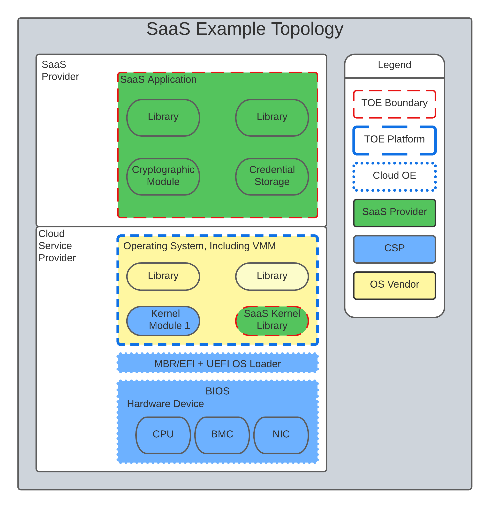
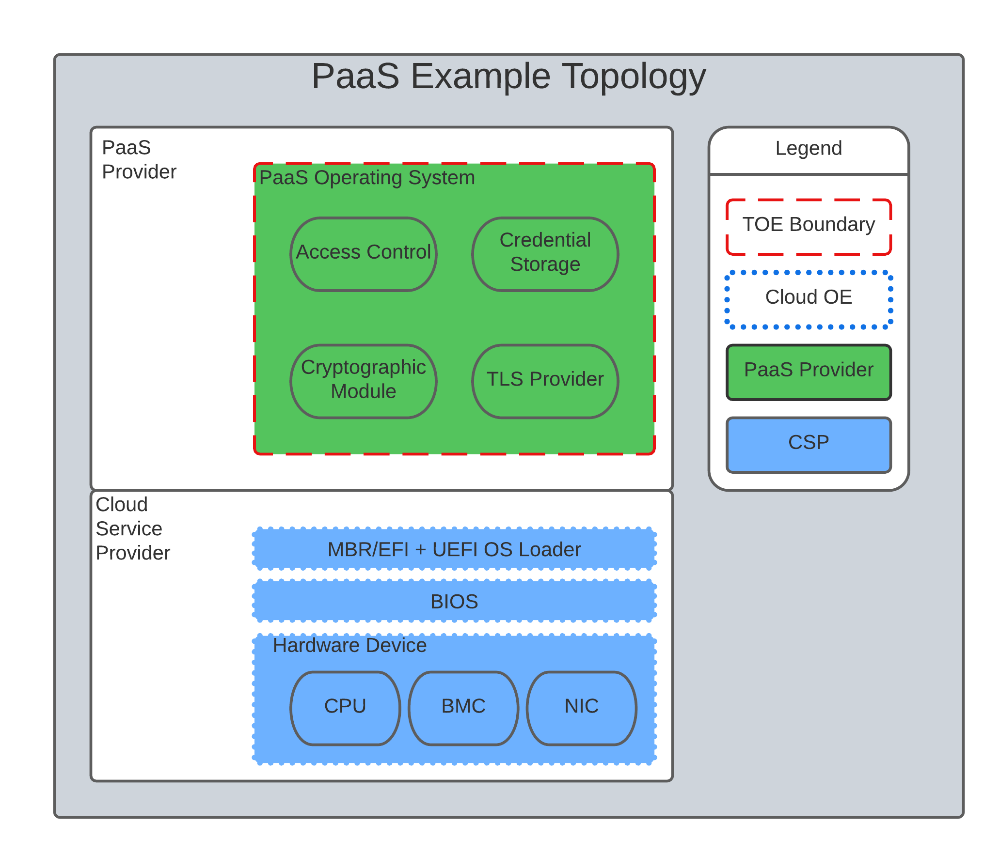
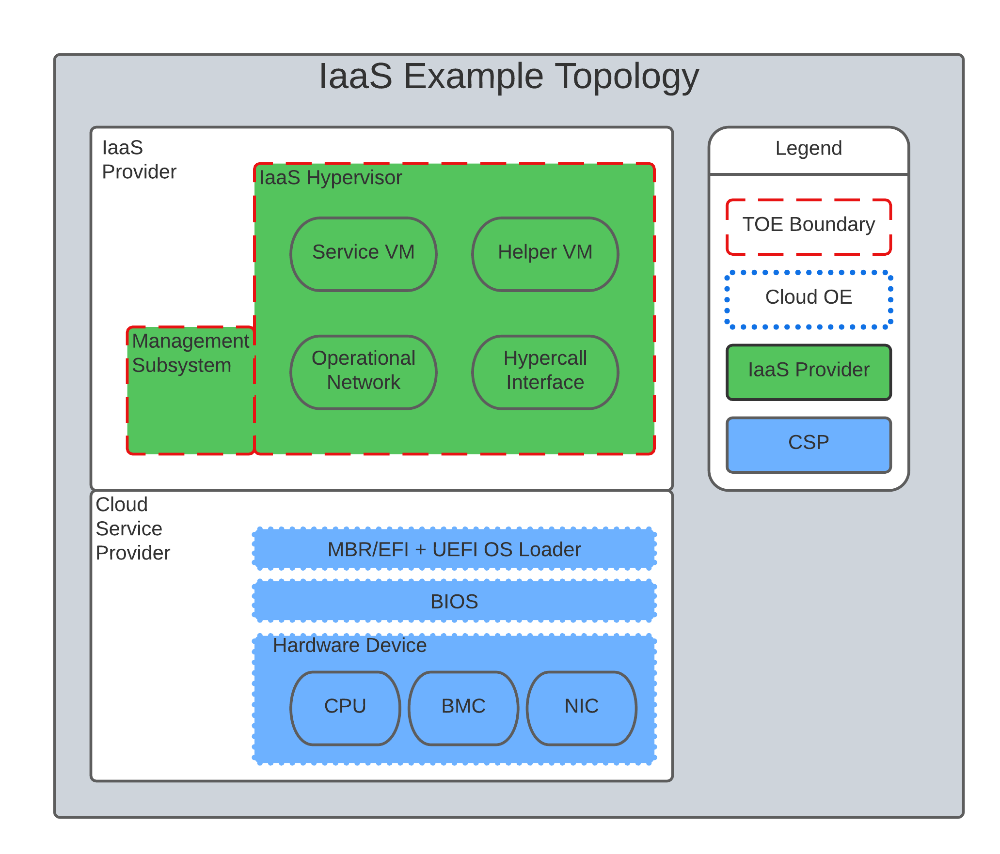

= _CC in the Cloud_ Essential Security Requirements
:showtitle:
:icons: font
:revnumber: 0.3.0
:revdate: 2022-03-02

:iTC-longname: Common Criteria in the Cloud iTC
:iTC-shortname: CCitC-iTC

[.text-center]
Version: {revnumber}
[.text-center]
Date: {revdate}

== Preface

The CC in the Cloud Technical Work Group (CCitC) is developing an Essential Security Requirements (ESR) document that captures the fundamental requirements for evaluating IT products applicable to CC which operate in Cloud environments. Such cloud environments may or may not conform to hybrid, public, or private cloud topologies and the associated Cloud Service Providers. This effort is not meant to replace solution or service oriented frameworks or certification processes. The initial draft of this document contains material that was created by the TWG as a framework to utilize Common Criteria methodologies for products operating in a cloud environment.

== Background and Purpose

There is not yet a defined and accepted method within the Common Criteria that addresses IT product evaluations in the cloud environment.

Today, CC reflects a static point in time for security evaluation methodology. Over the past several years, members of this TWG have witnessed customer migrations from an on-premise model where products are licensed and maintained to a services model where assurance benefits accrued from CC are not available in the cloud.

Customers are buying services, not products. “Gartner foresees double-digit growth in government use of public cloud services, with spending forecast to grow on average 17.1% per year through 2021.” --Understanding Cloud Adoption in Government

//https://www.gartner.com/smarterwithgartner/understanding-cloud-adoption-in-government//

“In fiscal 2019, the White House-issued cloud Smart strategy gave agencies a mandate to expedite their journeys to the cloud. Federal agencies spent a combined $5.9 billion in contract obligations on cloud infrastructure as a service (IaaS), platform as a service (PaaS), software as a service (SaaS), and other cloud support and migration services. They’re on track to spend $7.1 billion in fiscal 2020.”--The State of Federal cloud: Market Briefing

At some point customers are going to recognize that a CC evaluation of an Information Communication Technologies (ICT) product provides little assurance in a cloud environment. Without a plan for CC addressing this factor, CC will become irrelevant in DevOps and Customers will require additional country specific testing instead.

As the market moves to such cloud-based solutions, ISO/IEC15408 should be adapted in order to provide security assurance for cloud scenarios. In addition, vendors of products to be evaluated along with authors of cPP’s aimed at cloud use case evaluations, may need to add or alter specific code or cPP content carefully to ensure evaluate-able products and cPP’s.

== Use Cases

Products utilizing cloud platforms are expected to be evaluated within one of the following use cases:

====
The following examples are provided for additonal context. They are not fully representative of all possible cloud evaluation scenarios and are not meant to be an exclusive set.
====

*Use Case 1*: Software as a Service (SaaS). The capability provided to the consumer is to use the provider’s applications running on a cloud infrastructure. The applications are accessible from various client devices through either a thin client interface, such as a web browser (e.g., web-based email), or a program interface. The consumer does not manage or control the underlying cloud infrastructure including network, servers, operating systems, storage, or even individual application capabilities, with the possible exception of limited user specific application configuration settings. <<nist_cloud>>

The following PPs are examples which might be extended with CCitC methodolgy to cover the above use case: cPP_App_SW, cPP_DBMS, PP_MDM

For example, if the cPP for Application Software were to be used as a baseline the cloud extensions may be applied to the existing TOE Boundary and TOE Platform given in the following diagram:

.SaaS Example

In this example, the SaaS Application provided by the SaaS provider relies on a TOE platform from an OS Vendor which is hosted by the Cloud Service Provider on the CSPs hardware. In this Cloud evaluation scenario, additional TSS and Assurance Activities could be prescribed to expand the evaluated configuration in a Cloud Operating Environment. 

*Use Case 2*: Platform as a Service (PaaS). The capability provided to the consumer is to deploy onto the cloud infrastructure consumer-created or acquired applications created using programming languages, libraries, services, and tools supported by the provider. The consumer does not manage or control the underlying cloud infrastructure including network, servers, operating systems, or storage, but has control over the deployed applications and possibly configuration settings for the application-hosting environment. <<nist_cloud>>

The following PPs are examples which might be extended with CCitC methodolgy to cover the above use case: GP_OS_PP, cPP_ND

For example, if the Protection Profile for General Purpose Operating System were to be used as a baseline the cloud extensions may be applied to the existing TOE Boundary and Cloud Cloud Operating Environment given in the following diagram:

.Paas Example

In this example, the PaaS OS provided by the PaaS provider relies on a Cloud Operating Environment which is hosted by the Cloud Service Provider on the CSPs hardware. In this Cloud evaluation scenario, additional TSS and Assurance Activities could be prescribed to expand the evaluated configuration in a Cloud Operating Environment. 

*Use Case 3*: Infrastructure as a Service (IaaS). The capability provided to the consumer is to provision processing, storage, networks, and other fundamental computing resources where the consumer is able to deploy and run arbitrary software, which can include operating systems and applications. The consumer does not manage or control the underlying cloud infrastructure but has control over operating systems, storage, and deployed applications; and possibly limited control of select networking components (e.g., host firewalls) <<nist_cloud>>

The following PPs are examples which might be extended with CCitC methodolgy to cover the above use case: PP_BASE_VIRTUALIZATION

For example, if the Protection Profile for Virtualization were to be used as a baseline the cloud extensions may be applied to the existing TOE Boundary and Cloud Cloud Operating Environment given in the following diagram:

.IaaS Example

In this example, the IaaS hypervisor provided by the IaaS provider relies on a Cloud Operating Environment which is hosted by the Cloud Service Provider on the CSPs hardware. In this Cloud evaluation scenario, additional TSS and Assurance Activities could be prescribed to expand the evaluated configuration in a Cloud Operating Environment. 

== Known Evaluation Methodology Gaps

=== Analysis is Static

Traditional product evaluations, most equivalent to SaaS use cases, must adopt rigid and static boundaries with regards to product version, platform components, and product scope. These considerations are problematic when adopted to a dynamic operating environment like the cloud. This is true for PaaS and IaaS use cases as well.

In traditional CC evaluations, explicit detail of all TOE and Platform configurations and interactions between layers is required to ensure validation. Cloud certifications would likely require the concept of a Trusted Platform in which this detail often unknown and ephemeral, but the security posture is not diminished. 

=== Use of Cryptography

Current cryptography certification frameworks rely on extremely detailed algorithm, implementation, and entropy details that are not always available or predictable to end users or product vendors on various cloud platforms or environments.

//request for elaboration//

=== Platform Abstraction

Existing TOE composition requires stability in both the TOE and TOE Platform. The TOE operating environment in a cloud use case may or may not change dramatically due to a variety of factors such as hardware deprecation, underlying firmware updates, OS changes, etc. These changes may or may not be detected by the TOE and may or may not affect the TOE security posture. 

New methodology to address minimum satisfactory capabilities in this regard will be needed to bridge this gap such as a Trusted Platform scheme.

One such possibility may include the inheritence of IaaS and/or PaaS CCitC evaluation for SaaS use cases. Similarly, a PaaS evaluation may inherit IaaS collateral.

=== Environmental Evolution

Cloud environments are evolving as routine in order to provide new services and greater efficiencies to customers. Traditional certifications can not match pace. Furthermore, as cloud Hosting agreements are negotiated independently, access to the same platform or platforms used to evaluate a product cannot be guaranteed to the Common Criteria end user. 

== Provide additional threat model concerns for CCitC

The iTC will continue to review and monitor relevant Cloud Security Frameworks to capture additional threat considerations or assurance requirements. The following items were identified as particularly relevant for CC in the Cloud efforts.

=== Configuration

As cloud environments offer tremendous benefits of scale to IT Solutions, it is beneficial for product vendors to leverage autonomous deployment and delivery of TOE components. Traditional CC evidence such as Guidance Supplements or access to physical hardware may be difficult for cloud evaluations.

For example, container repositories and/or container orchestration configurations represent an area of interest for products and services using a cloud model that would require attention from PP or ST Authors and Evaluators targeting CC in the Cloud evaluations. 

=== Credentials

Traditional CC evaluations typically rely on trusted network or administrator assumptions with regards to credentials and credential management. As cloud environments inherently challenge these assumptions, it is critical to extended SFRs and SARs to meet additional TOE security objectives.

It is not sufficient to solely rely on data at rest protections for credentials or key material. CC in the Cloud evaluations must consider the entire lifecycle of secrets, (to include generation, destruction, revocation, etc) as well as any escrow needed to maintain product operations.

For example, a SaaS application that connects to a datastore may or may not be provisioned manually or programmatically. PP or ST Authors that wish to evaluate applications in a cloud deployment must ensure that credentials used to connect and encrypt/decrypt data within the cloud platform are not vulnerable to compromise.  

=== Data Sovereignty 

////
revisit this section before next release 
////

As cloud services often span various geographic and political jurisdictions it is critical to understand these aspects when a product is deployed in a Cloud Environment.

For example, CC in the Cloud evaluations with configuration settings pertinent to data center location may be needed to describe these elements in the appropriate design or lifecycle documentation. 

=== Key Management

Cloud service models inherently require compute, network, and storage resources to be dynamically provisioned and de-provisioned programmatically. This presents unique challenges with providing encryption capabilities due to the need to orchestrate key management and delivery. CC in the Cloud considerations must extend assurance such that these capabilities are clearly defined and understood within the scope of evaluation.

For example, virtual machines or containers that leverage encrypted storage volumes often require additional operational components to provide pre-boot authentication and/or HSM services for decryption operations. The key hierarchy and lifecycle within the CC in the Cloud use case are of additional concern in this threat model.

=== Insider Threat

Products and services provided through the cloud require trust on behalf of the vendors and user that extends to operational personnel far above non-cloud deployments.

This iTC will consider requirements or expansion of scope that includes Assurance Life Cycle (ALC) deliverables to satisfy these additional threat concerns.

=== Multi-tenant

Conventional CC evaluations typically assume that the TOE platform or underlying infrastructure is controlled at the enterprise level by a singular entity within the enterprise. In cloud environments, this assumption can not be included as the nature of cloud services inherently introduces an aspect of multiple enterprises (multi-tenant) sharing resources both physical and logical. 

For example, cloud customers of ICT products understand that moving to the cloud means sharing infrastructure with other customers. While Cloud Providers offering IaaS capabilities may offer dedicated hardware or instances to one cloud customer, this is the minority of cloud use cases.

This iTC will consider products deployed in a multi-tenant environment with respect to any optional or objective SFRs involving cloud use cases that mitigate Guest Escape, Data Leakage, Privilege Escalation, etc.

// highlight for each use case, not just application level //

== Assumptions

Ultimately, CC scheme input into this ITC will be critical to evolve these assumptions. For initial consideration, the following assumptions have been defined.

=== Trusted Platform

Cloud based service models inherently incur a trust relationship to certain components of the Information Technology solution. 

End users of Common Criteria in the Cloud certificates will require that changes to the underlying infrastructure do not degrade the security functionality of the TOE. This ITC will propose an approach that will allow for composable construction of a trusted platform concept for inheritence of assurance of underlying abstracts by leveraging existing collateral.

Areas for consideration may include:

** Any existing Common Criteria Certificates valid for the TOE Environment.
** Any existing cryptographic collateral information (e.g. FIPS 140, ISO/IEC 19790 or equivalent ) for the TOE Environment.
** Any existing TCG TPM information for the TOE Environment.

=== Trusted Provider/Admin

Similarly to the Trusted Platform concept from above, additional collateral is appropriate with regards to the Cloud Service Provider and their role as a Trusted Administrator.

Areas for consideration may include:

** Specify any existing governmental authorizations or assessments (e.g. FEDRAMP, CMMC) applicable for the TOE Environment.
** Specify any existing ISO/IEC 27001/2 certificate information.
** Specify any existing ISO/IEC 20243 (e.g. Open Group Trusted Technology Provider Standard) certificate information for the TOE Environment.

== Summary

The CCitC WG is focused on providing guidance to existing Common Criteria methodologies to enable the inclusion of Cloud technologies. The contents of this ESR is not an attempt to comprehensively address all implications needed for said effort, however, it attempts to outline the larger elements and challenges.

We acknowledge that the product evaluation structure inherent in Common Criteria can not be fundamentally changed or ignored. With continued development it is the goal of the CCitC WG to provide additional collateral for the inclusion of cloud deployments or configurations inclusive of cPP or ST conformance claims.

We plan to examine and reference existing and developing processes and certifications that could support the extension of cPP’s and ST’s to include cloud usage. The WG also intends to provide guidance as well as examples of specific terminology that could be used in whole or in part by developers of cPP’s and ST’s. In addition, the WG intends to document any limitations found and may consider or present options for future changes.

The WG recognizes that existing Cloud Security solution frameworks exist and the goal is not to replace or reinvent them nor to certify cloud solutions. However, consideration will be given if useful elements can be adapted towards the advancement of CC in the cloud efforts.

[bibliography]
== References

* [[[nist_cloud]]] NIST SP 800-145 "The NIST Definition of Cloud
Computing"

////
Parking Lot for iTC

=== Evaluate related approaches for re-use in CCitC

==== Evaluate MDM Equivalency appendix for re-use in CC in the Cloud SDs to address trusted platform issues
Review FIPS I.G G.5 for examples of post-validation equivalency arguments.

==== Identify procurement requirements for Cloud and propose updates to utilize CC in the Cloud outputs
////