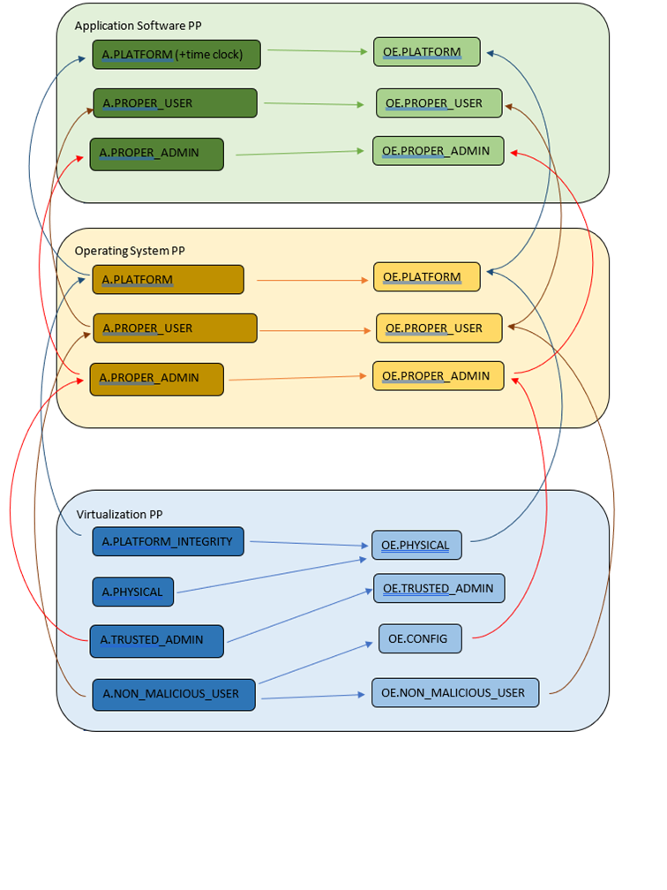
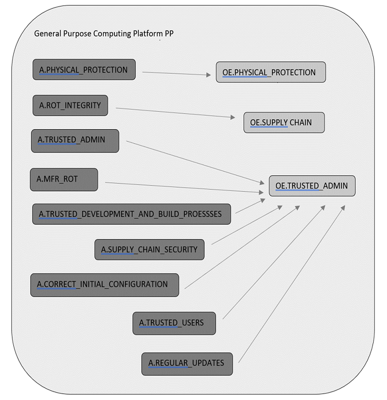

= Guidelines for optimising existing Protection Profiles to enable effective evaluation of TOEs operating in a cloud environment.
:showtitle:
:icons: font
:revnumber: 0.3
:revdate: 2023-Feb-08

:iTC-longname: Common Criteria in the Cloud iTC
:iTC-shortname: CCitC-iTC

[.text-center]
Version: {revnumber}
[.text-center]
Date: {revdate}

== 1. Introduction

The ‘CC in the Cloud’ TC has been looking at various aspects of providing guidance for evaluation of TOEs in a cloud environment, and the proposed initial approach is to provide guidance for existing Protection Profiles.

There are existing Protection Profiles already in use for ‘on premise’ evaluations that can be augmented to also allow vendors to complete an evaluation for their TOE in a cloud environment.

There is also a brief look at how a composition of PP’s might look in the ‘CC in the Cloud’ domain in the future. However, it should be noted that the initial focus is for individual PP’s being updated to consider TOEs in a Cloud Environment.

[NOTE]
====
While the approach proposed in the document gives some guidance on how to assess whether a cloud platform for a TOE is provided sufficient security assurance and satisfying the requirements of the PP, there are some aspects that require further work, namely:

[lowerroman]
    . _We want to be able to ‘re-use’ certificate evidence across OS/platforms/hw/etc._

_The NIAP App Software PP has ‘Equivalency Guidelines’ that may offer clues._

[lowerroman, start=2]
. _Re-using evidence from lower in the stack (e.g. CAVP) is unlikely to be a perfect version match (application evaluation likely to follow after O/S evaluation)._

_The ‘Equivalency Guidelines’ above explicitly still state that mapping to a CAVP certificate for one platform is required but further investigation required._

[lowerroman, start=3]
. _All layers of the stack are subject to continual security patching. Maintenance of the security level and the impact of new vulnerabiities, software development, evolving standards and attack capabilities should be considered._

_Current ISO ‘patch management for CC’ work is progressing but probably won’t cover a ‘periodic re-assessment’ type approach that may make sense in the cloud (patch-by-patch maintenance looks impractical)._
====

== 2. Steps to optimize a PP for TOEs in a cloud environment.

A PP comprises of a number of sections and each should be reviewed and updated in order to give directions to ST authors for TOEs in a cloud environment:

=== 2.1 Introduction

The introduction typically consists of a brief overview, a list of terms, a description of the TOE Boundary and TOE Platform, and Use Cases.

If not already existing it may be useful to add the following terms for cloud

_\{list of suggested terms}?_

The TOE Boundary and TOE Platform descriptions and associated diagrams should be updated to consider a cloud platform. In particular, the TOE Platform should explicitly mention that a cloud platform is an option for the TOE.

The Use Cases provided should include one for a cloud platform. Any existing text should be confirmed to be consistent with the approach taken for this document.

_\{example text}?_

=== 2.2 Conformance Claims

It is not expected that changes would be required to the Conformance Claims chapter. 

PP editors may consider including a reference to this guidance document within the updated PP.

=== 2.3 Security Problem Definition

This chapter describes security problems in terms of threats, assumptions and organizational security policies.

Appendix A details the Threats, Assumptions, Security Objectives for the TOE, and Security Objectives for the operational environment for a number of PP’s of interest.

Generally within the PP’s proposed, the Network Device and Application Software PPs are used the most.

In Appendix B specific aspects of the Assumptions and Security Objectives for the Operational Environment were considered to determine whether assumptions made for each PP of interest are consistent and could be satisfied by a cloud environment. The analysis found that the assumptions and Security Objectives of the Operating Environment for PP’s of interest are consistent: There are generally only three categories: Platform Integrity, Proper (Non-Malicious User) and Proper (Trusted) Admin. The virtualization PP considers also Physical Security but this not considered by the other PPs.

It is not necessarily expected that a cloud environment will introduce new threats, assumptions or organizational security policies, although the PP writers may wish to consider whether existing threats, assumptions and organization security policies should be refined to provide more explanation in the case of cloud.  For example, threat models may consider the impact of potential ubiquitous access and multi-tenancy to either add to existing threats, assumptions and organizational security policies or refine them.

=== 2.4 Security Objectives

Security Objectives for the TOE map to security functionalities/services of the TOE itself so it is not expected that changes would be required.

As described in Appendix B of this document, the Security Objectives of the Operating Environment provide the general requirements that should be satisfied by the cloud environment. It is proposed that PP's should include an appendix as guidance for an evaluator to assess whether the cloud environment for the TOE satisfies the Security Objectives of the Operating Environment of the PP. In the context of the PP’s highlighted, where the assurance level is low (no development security requirements, vulnerability requirements at AVA_VAN.1: public search), the assumptions and Security Objectives of the Operating Environment should be sufficiently satisfied by any suitable cloud security certification process recognized by a national government supporting Common Criteria, that addresses the environment being used(e.g. lowest level Fedramp, BSI C5 baseline, ISO27017).

The Security Objectives rationale is not expected to change, unless additional threats, assumptions or security objectives have been added.

=== 2.5 Security Requirements.

It is expected that some additional application notes would be appended to a PP regarding Security Requirements.

Security Functional Requirements should be each considered carefully as to whether there may be dependency on the cloud platform.

For example, Cryptographic Support (FCS) may include cryptographic operations using services of the platform, or random number generation derived from platform entropy sources. Others example would be any SFRs around boot integrity and maybe key destruction.

=== 2.6 Security Assurance Requirements.

Classes ASE and ADV are not expected to require change.

Class AGD will be evaluated similarly but the developer must provide guidance both the AGD_PRE and AGD_OPE that work for the cloud platform.

There also may be two scenarios for guidance:

[lowerroman]
. A developer providing guidance for their TOE to be installed and operated in a cloud environment. This may look very similar to the guidance for a typical ‘on-prem’ installation.
. A developer providing guidance for their TOE to be installed and operated on their own cloud environment. In this case the develop may provide installation and operational instructions specific to their cloud platform.

Class ALC changes expected to be minimal and should be resolved with minor adjustments. However, it is likely that care will be required around Flaw remediation and similar ALC aspects (including ALC_TSU_EXT.1.1 Timely Security Updates) as how they would work in a cloud platform.

Class ATE will require some additional application notes required around ‘provide the OS for testing’ for a cloud environment.

Class AVA would not be expected to require significant additional application notes.

=== 2.7 Other considerations

A text search of the term ‘platform’ is likely to highlight areas of a PP that will require modification in order to support evaluations in a Cloud environment (if not already resolved with the activities in sections 3.1-3.6

== 3. Appendix A: Threats, Assumptions and Security Objectives for each PP.

=== 3.1 Protection Profile for General Purpose Computing Platform, Version 1.0

==== 3.1.1 Use Cases +
[USE CASE 1]: Server-Class Platform, Basic

This use case encompasses server-class hardware in a data center. There are no additional physical protections required because the platform is assumed to be protected by the operational environment as indicated by A.PHYSICAL_PROTECTION. The platform is administered through a management controller that accesses the MC through a console or remotely.

This use case adds audit requirements and Administrator authentication requirements to the base mandatory requirements.

For changes to included SFRs, selections, and assignments required for this use case, see G.1 Server-Class Platform, Basic.

==== 3.1.2 Threats

T.PHYSICAL +
T.SIDE_CHANNEL_LEAKAGE +
T.PERSISTENCE +
T.UPDATE_COMPROMISE +
T.SECURITY_FUNCTIONALITY_FAILURE +
T.TENANT_BASED_ATTACK +
T.NETWORK_BASED_ATTACK +
T.UNAUTHORIZED_RECONFIGURATION +
T.UNAUTHORIZED_PLATFORM_ADMINISTRATOR

==== 3.1.3 Assumptions

A.PHYSICAL_PROTECTION +
A.ROT_INTEGRITY +
A.TRUSTED_ADMIN +
A.MFR_ROT +
A.TRUSTED_DEVELOPMENT_AND_BUILD_PROCESSES +
A.SUPPLY_CHAIN_SECURITY +
A.CORRECT_INITIAL_CONFIGURATION +
A.TRUSTED_USERS +
A.REGULAR_UPDATES

==== 3.1.4 Security Objectives for the TOE

O.PHYSICAL_INTEGRITY +
O.ATTACK_DECECTION_AND_RESPONSE +
O.MITIGATE_FUNDAMENTAL_FLAWS +
O.PROTECTED_FIRMWARE +
O.UPDATE_INTEGRITY +
O.STRONG_CRYPTOGRAPHY +
O.SECURITY_FUNCTIONALITY_INTEGRITY +
O.TENANT_SECURITY +
O.TRUSTED_CHANNELS +
O.CONFIGURATION_INTEGRITY +
O.AUTHORIZED_ADMINISTRATOR

==== 

==== 

==== 3.1.5 Security Objectives for the Operational Environment

OE.PHYSICAL_PROTECTION +
OE.SUPPLY_CHAIN +
OE.TRUSTED_ADMIN

=== 3.2 Base PP for Virtualization Version 1.1

==== 3.2.1 Use Cases +
None for Cloud

==== 3.2.2 Threats

T.DATA_LEAKAGE +
T.UNAUTHORISED_UPDATE +
T.UNAUTHORIZED_MODIFICATION +
T.USER_ERROR +
T.3P_SOFTWARE +
T.VMM_COMPROMISE +
T.PLATFORM_COMPROMISE +
T.UNAUTHORIZED_ACCESS +
T.WEAK_CRYPTO +
T.UNPATCHED_SOFTWARE +
T.MISCONFIGURATION +
T.DENIAL_OF_SERVICE

==== 3.2.3 Assumptions

A.PLATFORM_INTEGRITY +
A.PHYSICAL +
A.TRUSTED_ADMIN +
A.NON_MALICIOUS_USER
 

==== 3.2.4 Security Objectives for the TOE

O.VM_ISOLATION +
O.VMM_INTEGRITY +
O.PLATFORM_INTEGRITY +
O.DOMAIN_INTEGRITY +
O.MANAGEMENT_ACCESS +
O.PATCHED_SOFTWARE +
O.VM_ENTROPY +
O.AUDIT +
O.CORRECTLY_APPLIED_CONFIGURATION +
O.RESOURCE_ALLOCATION

==== 3.2.5 Security Objectives for the Operational Environment

OE.CONFIG +
OE.PHYSICAL +
OE.TRUSTED_ADMIN +
OE.NON_MALICIOUS_USER

=== 3.3 Protection Profile for General Purpose Operating Systems Version 4.3

==== 3.3.1 [USE CASE 3] Cloud Systems

The OS provides a platform for providing cloud services running on physical or virtual hardware. An OS is typically part of offerings identified as Infrastructure as a Service (IaaS), Software as a Service (SaaS), and Platform as a Service (PaaS).

This use case typically involves the use of virtualization technology which should be evaluated against the Protection Profile for Server Virtualization.

==== 3.3.2 Threats

T.NETWORK_ATTACK +
T.NETWORK_EAVESDROP +
T.LOCAL_ATTACK +
T.LIMITED_PHYSICAL_ACCESS

==== 3.3.3 Assumptions

A.PLATFORM +
A.PROPER_USER +
A.PROPER_ADMIN

==== 3.3.4 Security Objectives for the Operational Environment

OE.PLATFORM +
OE.PROPER_USER +
OE.PROPER_ADMIN

=== Protection Profile for Application Software Version 1.4

==== 3.4.1 Use Cases +
None for Cloud

==== 3.4.2 Threats

T.NETWORK_ATTACK +
T.NETWORK_EAVESDROP +
T.LOCAL_ATTACK +
T. PHYSICAL_ACCESS

==== 3.4.3 Assumptions

A.PLATFORM (+ time clock) +
A.PROPER_USER +
A.PROPER_ADMIN

==== 3.4.4 Security Objectives for the TOE +
O.INTEGRITY +
O.QUALITY +
O.MANAGEMENT +
O.PROTECTED_STORAGE +
O.PROTECTED_COMMS

==== 3.4.5 Security Objectives for the Operational Environment

OE.PLATFORM +
OE.PROPER_USER +
OE.PROPER_ADMIN

== 4 Appendix B. Analysis of the Assumptions and Security Objectives of the Operating Environment for an example stack of PP’s

As a way of gaining understanding of how existing PP’s may work within the cloud environment, a ‘composition stack’ of PP’s is considered.

As an example,

An Application,
____
*(PP for Application Software)*
____
or Network Device  
____
*(Network Device cPP)*
____
running on an Operating System, 
____
*(PP for General Purpose Operating System)*
____

running in a VM, 
____
*(Base PP for Virtualization)*
____

on a Server.      
____
*(PP for General Purpose Computing Platform)*
____

 

It can be observed that for each PP higher in the stack, it may rely on security services that may or may not be provided by PP’s lower in the stack. It can also generally be observed that the ‘Platform’ for any PP tends to the be PP immediately below in the stack.

The assumptions and Security Objectives of the Operating Environment for the three PP’s map in this example map well to each other. There are generally only three categories: Platform Integrity, Proper (Non-Malicious User) and Proper (Trusted) Admin. The virtualization PP considers also Physical Security but this not considered by the other PPs.

In the context of these PP’s, where the assurance level is low (no development security requirements, vulnerability requirements at AVA_VAN.1: public search), the assumptions and Security Objectives of the Operating Environment should be sufficiently satisfied by any suitable cloud security certification process recognized by a national government supporting Common Criteria that addresses the environment being used. (e.g. lowest level Fedramp, BSI C5 baseline, ISO27017).

If the General Purpose Computing Platform PP is adopted by vendors for cloud infrastructure, then this could be added to the model since it is a number of additional assumptions around root-of-trust and supply chain security that could provide additional assurance.

